# Agent 平台包设计方案

> 将 `app/agent_platform/` 从子目录改造为独立 Python 包 `agent-platform`，
> 上层应用通过导入包、调用方法的方式使用平台能力。

---

## 一、架构概览

```
┌─────────────────────────────────────────────────────┐
│                  应用层 (Application)                │
│                                                     │
│  my-coding-agent/                                   │
│  ├── main.py          ← 暴露 HTTP/SSE 端点           │
│  ├── .lania/agents/   ← Agent 定义                  │
│  ├── tools/           ← 自定义工具                   │
│  └── frontend/        ← UI                          │
│                                                     │
│  from agent_platform import AgentPlatformContainer    │
│  container = AgentPlatformContainer(settings)        │
│  container.agent_service.process(...)                │
└──────────────────────┬──────────────────────────────┘
                       │ 依赖
┌──────────────────────▼──────────────────────────────┐
│              agent-platform（pip 包）                  │
│                                                      │
│  agent_platform/                                     │
│  ├── container.py     ← AgentPlatformContainer       │
│  ├── agents/brain/    ← AgentLoop / 执行引擎          │
│  ├── services/        ← 所有平台服务                   │
│  ├── harness/         ← guardrails / policy / hooks   │
│  ├── capabilities/    ← 工具能力注册                  │
│  ├── models/          ← 数据模型                      │
│  └── core/            ← 配置 / 认证 / 日志             │
└──────────────────────────────────────────────────────┘
```

---

## 二、核心扩展点（Plugin Protocol）

平台定义接口，用户提供实现。内置零依赖的默认实现，不强制用户选框架。

### 2.1 LLM Protocol — 模型供应商

```python
# agent_platform/llm/protocol.py
from collections.abc import AsyncIterator
from dataclasses import dataclass, field
from typing import Any, Protocol


@dataclass
class ChatResponse:
    content: str
    tool_calls: list[dict[str, Any]] | None = None
    usage: dict[str, Any] | None = None


@dataclass
class StreamChunk:
    type: str  # "delta" | "tool_call_delta" | "stop"
    text: str = ""
    tool_call: dict[str, Any] | None = None


class LLM(Protocol):
    """LLM 供应商接口。用户可实现此协议接入任意模型。"""

    async def chat(
        self,
        messages: list[dict[str, Any]],
        tools: list[dict[str, Any]] | None = None,
    ) -> ChatResponse:
        """同步调用。返回完整响应。"""

    async def chat_stream(
        self,
        messages: list[dict[str, Any]],
        tools: list[dict[str, Any]] | None = None,
    ) -> AsyncIterator[StreamChunk]:
        """流式调用。逐块返回。"""


# 内置默认实现：OpenAI，零额外依赖
class OpenAILLM:
    """只依赖 httpx 的 OpenAI 兼容实现。"""

    def __init__(
        self,
        model: str = "gpt-4o",
        api_key: str | None = None,
        base_url: str | None = None,
    ) -> None: ...
```

**用户接入其他模型：**

```python
from agent_platform.llm.protocol import LLM, ChatResponse
from anthropic import AsyncAnthropic

class AnthropicLLM(LLM):
    def __init__(self, api_key: str):
        self._client = AsyncAnthropic(api_key=api_key)

    async def chat(self, messages, tools=None):
        resp = await self._client.messages.create(
            model="claude-3-opus", messages=messages,
        )
        return ChatResponse(content=resp.content[0].text)

container = AgentPlatformContainer(
    settings=settings,
    llm=AnthropicLLM(api_key="sk-ant-..."),
)
```

---

### 2.2 Storage Backend — 持久化存储

```python
# agent_platform/store/protocol.py
from typing import Any, Protocol


class StateStore(Protocol):
    """持久化存储接口。平台内置 SQLite 实现。"""

    # ── 生命周期 ──
    def load_into(self, state: Any) -> None: ...
    def ping(self) -> str: ...

    # ── Task ──
    def get_task(self, task_id: str) -> dict | None: ...
    def upsert_task(self, payload: dict) -> None: ...
    def list_tasks(self) -> list[dict]: ...
    def claim_next_task(self, worker_id: str, lease_seconds: int) -> dict | None: ...
    def touch_task_heartbeat(self, task_id: str, worker_id: str, lease_seconds: int) -> dict | None: ...

    # ── TaskRun ──
    def get_task_run(self, run_id: str) -> dict | None: ...
    def upsert_task_run(self, record: dict) -> None: ...
    def list_task_runs(self) -> list[dict]: ...

    # ── Artifact ──
    def get_artifact(self, artifact_id: str) -> dict | None: ...
    def upsert_artifact(self, payload: dict) -> None: ...
    def list_artifacts(self) -> list[dict]: ...
    def list_artifacts_for_task(self, task_id: str) -> list[dict]: ...

    # ── Session ──
    def get_session(self, session_id: str) -> dict | None: ...
    def upsert_session(self, session_id: str, payload: dict) -> None: ...
    def delete_session(self, session_id: str) -> None: ...

    # ── UserProfile ──
    def get_user_profile(self, user_id: str) -> dict | None: ...
    def upsert_user_profile(self, user_id: str, payload: dict) -> None: ...

    # ── AgentDef ──
    def get_agent_def(self, agent_id: str) -> dict | None: ...
    def upsert_agent_def(self, payload: dict) -> None: ...
    def list_agent_defs(self) -> list[dict]: ...
    def delete_agent_def(self, agent_id: str) -> None: ...

    # ── Skill ──
    def get_skill(self, skill_id: str) -> dict | None: ...
    def upsert_skill(self, payload: dict) -> None: ...
    def list_skills(self) -> list[dict]: ...
    def delete_skill(self, skill_id: str) -> None: ...
    def upsert_skill_rule(self, payload: dict) -> None: ...
    def list_skill_rules(self) -> list[dict]: ...
    def delete_skill_rule(self, rule_id: str) -> None: ...

    # ── Prompt ──
    def get_prompt(self, prompt_id: str) -> dict | None: ...
    def upsert_prompt(self, payload: dict) -> None: ...
    def list_prompts(self) -> list[dict]: ...
    def delete_prompt(self, prompt_id: str) -> None: ...

    # ── MCP ──
    def get_mcp_server(self, mcp_id: str) -> dict | None: ...
    def upsert_mcp_server(self, payload: dict) -> None: ...
    def list_mcp_servers(self) -> list[dict]: ...
    def delete_mcp_server(self, mcp_id: str) -> None: ...

    # ── Consent ──
    def get_consent(self, user_id: str, tool_name: str) -> dict | None: ...
    def save_consent(self, user_id: str, tool_name: str, payload: dict) -> None: ...

    # ── PolicyProfile ──
    def list_policy_profiles(self) -> list[dict]: ...


# 内置默认实现：SQLite
class SQLiteStateStore:
    """平台自带的 SQLite 实现。""" ...
```

**用户接入 Redis/Postgres：**

```python
from agent_platform.store.protocol import StateStore
import asyncpg

class PostgresStateStore(StateStore):
    def __init__(self, dsn: str):
        self._pool = asyncpg.create_pool(dsn)
    ...

container = AgentPlatformContainer(
    settings=settings,
    store=PostgresStateStore(dsn="postgres://..."),
)
```

---

### 2.3 Tool Lifecycle Hook — 工具执行钩子

**统一设计：平台层只认 `ToolHook` 协议，两种使用方式共享同一个内部接口。**

```python
# agent_platform/hooks/protocol.py
from dataclasses import dataclass, field
from typing import Any, Literal, Protocol


HOOK_EVENTS = Literal[
    "before_tool",      # 工具执行前（可阻断）
    "after_tool",       # 工具执行后（只读）
    "tool_failed",      # 工具执行失败
    "before_react_turn",# ReAct 轮次开始
    "after_react_turn", # ReAct 轮次结束
    "run_started",      # 一次 Agent 执行开始
    "run_completed",    # 一次 Agent 执行完成
    "run_failed",       # 一次 Agent 执行失败
]

@dataclass
class HookDecision:
    """Hook 执行结果。allow=False 可阻断后续执行。"""
    allow: bool = True
    reason: str = ""
    override_result: Any | None = None
    audit_log: dict[str, Any] | None = None


class ToolHook(Protocol):
    """工具执行钩子。平台内部统一使用此协议。"""

    async def on_event(
        self,
        event: HOOK_EVENTS,
        payload: dict[str, Any],
    ) -> HookDecision:
        """事件触发时调用。payload 包含事件上下文（tool_name, args, result 等）。"""
        return HookDecision()
```

#### 方式一：文件式（面向最终用户）

用户在 `.lania/hooks/` 下写 YAML 配置文件，无需写代码：

```yaml
# .lania/hooks/audit-all-tools.yaml
on: after_tool
action: audit
target: all
params:
  channel: database
```

```yaml
# .lania/hooks/block-dangerous-commands.yaml
on: before_tool
action: block
target:
  tools: [shell_execute, execute_batch]
  risk_levels: [critical]
params:
  reason: "高危命令已被系统策略禁止"
```

平台内置 `FileHookRunner` 加载并执行这些配置：

```python
# 平台内置实现
class FileHookRunner:
    """读取 .lania/hooks/*.yaml，解析为 ToolHook 协议。"""
    def __init__(self, hooks_dir: str | Path):
        self._loader = HookLoader(hooks_dir)
        self._engine = HookActionEngine()

    async def on_event(self, event, payload):
        matched_hooks = self._loader.match(event, payload)
        for hook in matched_hooks:
            result = await self._engine.execute(hook.action, payload)
            if not result.allowed:
                return HookDecision(allow=False, reason=result.reason)
        return HookDecision()
```

#### 方式二：编程式（面向开发者）

开发者实现 `ToolHook` 协议，注册到容器：

```python
from agent_platform.hooks.protocol import ToolHook, HookDecision

# 审计日志
class AuditLogger:
    async def on_event(self, event, payload):
        if event in ("before_tool", "after_tool"):
            log_audit(user=payload.get("user_id"), event=event, data=payload)
        return HookDecision()

# 速率限制
class RateLimiter:
    async def on_event(self, event, payload):
        if event == "before_tool":
            user = payload.get("user_id", "anonymous")
            if self._is_rate_limited(user):
                return HookDecision(allow=False, reason="请求过于频繁")
        return HookDecision()

# 注册
container.register_tool_hook(FileHookRunner("./lania/hooks"))
container.register_tool_hook(AuditLogger())
container.register_tool_hook(RateLimiter())
```

#### 两种方式的关系

```
                    ToolHook 协议
                   ┌─────────────┐
                   │  on_event()  │
                   └──────┬──────┘
                          │ 实现
              ┌───────────┴───────────┐
              │                       │
     FileHookRunner           AuditLogger / RateLimiter / ...
   (.lania/hooks/*.yaml)      (Python 代码)
              │                       │
              │ 内部使用               │
     HookLoader + HookActionEngine    │
```

| 维度 | 文件式 | 编程式 |
|---|---|---|
| **用户** | 非开发者（填写 YAML） | 开发者（写 Python） |
| **能力** | log / block / audit / notify / throttle | 任意 Python 逻辑 |
| **存储** | `.lania/hooks/` 文件系统 | 代码仓库 |
| **适用场景** | 审计、阻断、限流等标准治理 | 自定义监控、动态策略、第三方集成 |

#### 执行顺序

所有注册的 `ToolHook` 按注册顺序依次执行。任何一个返回 `allow=False` 则阻断后续执行：

```python
async def _execute_hooks(self, event, payload):
    for hook in self._tool_hooks:
        decision = await hook.on_event(event, payload)
        if not decision.allow:
            return decision  # 阻断，不继续执行后续 hook
    return HookDecision(allow=True)
```

#### ToolHook 与 ToolSandbox 的执行联动

`before_tool` hook 和 `ToolSandbox` 是两层独立的防护，它们按固定顺序配合：

```
StepExecutor.execute_step(tool_call)
  │
  ├─ 1. before_tool hook（所有注册的 hook 依次执行）
  │     ├─ 通过 → 继续
  │     └─ 阻断 → 返回 HookDecision(allow=False)，不执行工具
  │
  ├─ 2. 检查工具在白名单中（agent_def.allowed_tools）
  │     ├─ 在白名单中 → 继续
  │     └─ 不在 → 拒绝执行
  │
  ├─ 3. 检查工具 risk_level
  │     ├─ low    → StepExecutor._tool_registry.run()   # 内联执行
  │     ├─ medium → asyncio.to_thread(...)               # 线程隔离
  │     ├─ high   → ToolSandbox.run_in_sandbox(...)      # 沙箱隔离
  │     └─ critical → 拒绝执行（须审批）
  │
  ├─ 4. after_tool hook（只读审计）
  │
  └─ 5. tool_failed hook（仅在工具抛出异常时触发）
```

**关键规则**：
- before_tool hook 阻断后，Sandbox 不会被执行——避免不必要的资源开销
- risk_level 的默认值来自工具定义，但 `agent_def.risk_level_overrides` 可以按 agent 类型覆盖
- after_tool hook 是只读的，不能阻断或修改结果
- tool_failed hook 可以触发告警、写入错误日志、或执行降级策略
```

---

### 2.4 Observability Export — 可观测导出

```python
# agent_platform/observability/protocol.py
from dataclasses import dataclass, field
from typing import Any, Protocol


@dataclass
class Span:
    """一次 Agent 执行的一个阶段。"""
    name: str
    start_time: float
    end_time: float
    attributes: dict[str, Any] = field(default_factory=dict)
    events: list[dict[str, Any]] = field(default_factory=list)
    error: str | None = None


@dataclass
class AgentTrace:
    """一次完整的 Agent 执行追踪。"""
    trace_id: str
    session_id: str
    agent_name: str
    spans: list[Span]
    total_tokens: int
    total_latency_ms: float
    tool_calls: int
    errors: int


class TraceExporter(Protocol):
    """追踪数据导出接口。用户可接入 Prometheus/LangSmith/OpenTelemetry 等。"""

    async def export(self, trace: AgentTrace) -> None: ...


# 内置默认实现：Console 日志
class ConsoleExporter:
    async def export(self, trace: AgentTrace) -> None:
        print(f"[trace] {trace.agent_name} | tokens={trace.total_tokens} | "
              f"latency={trace.total_latency_ms:.0f}ms | errors={trace.errors}")


# 用户接入 Prometheus
from prometheus_client import Counter, Histogram

class PrometheusExporter:
    def __init__(self):
        self._tool_calls = Counter("agent_tool_calls", "...")
        self._latency = Histogram("agent_latency_ms", "...")

    async def export(self, trace: AgentTrace) -> None:
        self._tool_calls.inc(trace.tool_calls)
        self._latency.observe(trace.total_latency_ms)


# 用户接入 OpenTelemetry
from opentelemetry import trace

class OTelExporter:
    async def export(self, trace_data: AgentTrace) -> None:
        tracer = trace.get_tracer(__name__)
        with tracer.start_as_current_span("agent_run") as span:
            span.set_attribute("agent", trace_data.agent_name)
            span.set_attribute("tokens", trace_data.total_tokens)


container.register_trace_exporter(PrometheusExporter())
```

---

### 2.5 扩展点汇总

| 扩展点 | 协议 | 内置实现 | 谁需要实现 |
|---|---|---|---|
| **LLM** | `LLM` | `OpenAILLM` | 想换模型供应商的人 |
| **Storage** | `StateStore` | `SQLiteStateStore` | 生产环境需要高可用存储的人 |
| **Tool Hook** | `ToolHook` | `FileHookRunner`（加载 `.lania/hooks/`） | 需要审计/日志/自定义阻断逻辑的人 |
| **Observability** | `TraceExporter` | `ConsoleExporter` | 需要监控/告警/性能分析的人 |

`AgentPlatformContainer` 接受所有扩展点作为构造参数或注册方法：

```python
container = AgentPlatformContainer(
    settings=settings,
    llm=AnthropicLLM(api_key="..."),           # 扩展点 1
    store=PostgresStateStore(dsn="..."),         # 扩展点 2
)
container.register_tool_hook(AuditLogger())     # 扩展点 3
container.register_trace_exporter(OTelExporter())  # 扩展点 4

### 2.6 Agent 类型系统 — 工具可见性与权限模型

Agent 类型决定了 LLM 能「看到」什么和能「调用」什么。这是让 LLM 不跑偏的第一道闸门。

```
Agent 定义 (AgentDef)
├── agent_type: "coding" | "document_analysis" | "research" | "chat"
├── allowed_tools: [read_file, search_code, ...]    ← LLM 只能看到这些工具
├── risk_level_overrides: {shell_execute: "critical"} ← 覆盖工具默认风险等级
├── max_turns: 50                                    ← 预算上限
├── default_system_prompt: "你是 Coding Agent..."    ← 角色设定
└── hooks: [audit_all, block_dangerous]              ← 生效的钩子
```

**规则**：

1. `AgentLoop.run()` 只向 LLM 暴露 `agent_def.allowed_tools` 中的工具
2. 即使 LLM 构造了不在白名单中的工具名，`StepExecutor` 会直接拒绝执行
3. 未指定 `allowed_tools` 时，使用该 `agent_type` 的默认工具集
4. 应用层可以在注册容器时注入自定义的 `agent_type → tools` 映射

```python
# 应用层注册 agent 类型
container.register_agent_type("coding", default_tools=[
    read_file_tool, search_code_tool, run_test_tool,
])
container.register_agent_type("document", default_tools=[
    retrieve_docs_tool, summarize_tool, extract_entities_tool,
])

# 创建 agent 实例时自动继承类型默认工具集
container.create_agent({
    "name": "my-coding-agent",
    "agent_type": "coding",
    "allowed_tools": ["read_file", "search_code", "run_test"],
})
```

**为什么这是第一道闸门**：LLM 只能从它看到的工具列表中做选择。如果 coding agent 看不到 `database_query` 工具，它就不可能调用数据库。这比任何运行时检查都更根本。
```

## 三、`AgentPlatformContainer` — 唯一入口

### 3.1 构造方法

| 属性 | 类型 | 用途 |
|---|---|---|
| `.settings` | `PlatformSettings` | 平台配置（只读） |
| `.state` | `InMemoryState` | 运行时状态（热缓存） |
| `.store` | `SQLiteStateStore` | 持久化存储 |
| `.tool_registry` | `ToolRegistry` | 工具注册表 |
| `.agent_service` | `AgentService` | **Agent 对话主入口** |
| `.agent_loop` | `AgentLoop` | Brain 执行循环 |
| `.session_manager` | `SessionManager` | 会话管理 |
| `.customization_engine` | `CustomizationEngine` | 原语加载引擎 |
| `.skill_manager` | `SkillManager` | Skill 管理 |
| `.agent_def_manager` | `AgentDefManager` | Agent 定义管理 |
| `.prompt_manager` | `PromptManager` | 提示词管理 |
| `.mcp_manager` | `McpManager` | MCP 工具管理 |
| `.llm_config_manager` | `LlmConfigManager` | LLM 配置管理 |
| `.system_settings_manager` | `SystemSettingsManager` | 系统设置管理 |
| `.auth_manager` | `AuthManager` | 认证管理 |
| `.safety_engine` | `SafetyEngine` | 安全引擎 |
| `.consent_store` | `ConsentStore` | 用户确认存储 |
| `.brain_context_manager` | `BrainContextManager` | 上下文管理 |
| `.step_executor` | `StepExecutor` | 步骤执行器 |
| `.event_bus` | `EventBus` | 事件总线 |

### 2.3 公开方法

```python
class AgentPlatformContainer:
    # ── 生命周期 ──────────────────────────────────────

    def start(self, start_worker: bool = False):
        """启动平台后台服务（worker/调度器）。"""

    def shutdown(self):
        """释放后台资源。"""

    def register_default_tools(self):
        """注册平台内置工具（天气/金融/日历/计算器等 20+ 工具）。"""

    def register_tool(self, tool: AgentTool):
        """注册单个自定义工具。"""

    def register_external_services(self, services: dict[str, Any]):
        """注入应用层提供的外部服务（RAG、数据库等）。"""

    # ── 原语管理（原 admin API，现为方法调用）─────────

    # Agent 定义
    def list_agents(self) -> list[AgentDefinition]: ...
    def get_agent(self, agent_id: str) -> AgentDefinition | None: ...
    def create_agent(self, payload: dict) -> AgentDefinition: ...
    def update_agent(self, agent_id: str, payload: dict) -> AgentDefinition: ...
    def delete_agent(self, agent_id: str) -> None: ...
    def set_default_agent(self, agent_id: str) -> None: ...

    # Skill
    def list_skills(self) -> list[SkillSpec]: ...
    def get_skill(self, skill_id: str) -> SkillSpec | None: ...
    def create_skill(self, payload: dict) -> SkillSpec: ...
    def update_skill(self, skill_id: str, payload: dict) -> SkillSpec: ...
    def delete_skill(self, skill_id: str) -> None: ...

    # Prompt
    def list_prompts(self) -> list[PromptTemplate]: ...
    def get_prompt(self, prompt_id: str) -> PromptTemplate | None: ...
    def create_prompt(self, payload: dict) -> PromptTemplate: ...
    def update_prompt(self, prompt_id: str, payload: dict) -> PromptTemplate: ...
    def delete_prompt(self, prompt_id: str) -> None: ...
    def render_prompt(self, name: str, **variables) -> str: ...
    def reset_prompt(self, prompt_id: str) -> None: ...

    # LLM 配置
    def list_llm_providers(self) -> list[LlmProvider]: ...
    def set_llm_provider(self, name: str, config: dict) -> LlmProvider: ...
    def delete_llm_provider(self, name: str) -> None: ...
    def test_llm_connection(self, name: str) -> bool: ...
    def get_active_llm(self) -> str: ...
    def set_active_llm(self, name: str) -> None: ...
    def set_llm_route(self, purpose: str, provider: str) -> None: ...

    # MCP Server
    def list_mcp_servers(self) -> list[McpServerConfig]: ...
    def create_mcp_server(self, payload: dict) -> McpServerConfig: ...
    def delete_mcp_server(self, mcp_id: str) -> None: ...
    def connect_mcp(self, mcp_id: str) -> bool: ...
    def disconnect_mcp(self, mcp_id: str) -> None: ...
    def list_mcp_tools(self) -> list[dict]: ...

    # 系统设置
    def get_settings(self) -> dict: ...
    def get_setting(self, key: str) -> Any: ...
    def set_setting(self, key: str, value: Any) -> None: ...

    # Instructions
    def create_instruction(self, payload: dict) -> Instruction: ...
    def list_instructions(self) -> list[Instruction]: ...
    def delete_instruction(self, instruction_id: str) -> None: ...

    # Hooks
    def list_hooks(self) -> list[HookDefinition]: ...
    def create_hook(self, payload: dict) -> HookDefinition: ...
    def delete_hook(self, hook_id: str) -> None: ...

    # ── Agent 交互 ────────────────────────────────────

    async def process_chat(
        self,
        message: str,
        session_id: str | None = None,
        agent_name: str | None = None,
        mode: str = "auto",
    ) -> AsyncIterator[AgentEvent]:
        """核心对话入口。返回 SSE 事件流。"""

    async def execute_command(
        self,
        message: str,
        session_id: str | None = None,
    ) -> str:
        """同步执行一条命令，返回结果文本。"""
```

---

## 四、存储层设计

### 3.1 `InMemoryState` — 运行时热缓存

```python
@dataclass
class InMemoryState:
    tasks: dict[str, TaskMemoryEntry] = field(default_factory=dict)
    task_runs: dict[str, TaskRunRecord] = field(default_factory=dict)
    artifacts: dict[str, ArtifactMemoryEntry] = field(default_factory=dict)
    collections: dict[str, Any] = field(default_factory=dict)
    sessions: dict[str, Any] = field(default_factory=dict)
    query_runs: dict[str, Any] = field(default_factory=dict)
```

- 纯数据容器，无方法
- 平台模块通过 `container.state.X` 读写
- `container.store.load_into(container.state)` 在启动时从 SQLite 恢复

### 3.2 `SQLiteStateStore` — 持久化存储

统一存储所有平台数据的 SQLite 实现，31 个方法分 10 类：

| 分类 | 方法 |
|---|---|
| 生命周期 | `__init__(db_path)`, `load_into(state)`, `ping()` |
| Task | `get_task`, `upsert_task`, `list_tasks`, `claim_next_task`, `touch_task_heartbeat` |
| TaskRun | `get_task_run`, `upsert_task_run`, `list_task_runs` |
| Artifact | `get_artifact`, `upsert_artifact`, `list_artifacts`, `list_artifacts_for_task` |
| Session | `get_session`, `upsert_session`, `delete_session` |
| UserProfile | `get_user_profile`, `upsert_user_profile` |
| AgentDef | `get_agent_def`, `upsert_agent_def`, `list_agent_defs`, `delete_agent_def` |
| Skill | `get_skill`, `upsert_skill`, `list_skills`, `delete_skill`, `upsert_skill_rule`, `list_skill_rules`, `delete_skill_rule` |
| Prompt | `get_prompt`, `upsert_prompt`, `list_prompts`, `delete_prompt` |
| MCP | `get_mcp_server`, `upsert_mcp_server`, `list_mcp_servers`, `delete_mcp_server` |
| Consent | `get_consent`, `save_consent` |
| PolicyProfile | `list_policy_profiles` |

---

## 五、使用示例

### 4.1 最简集成

```python
from agent_platform import AgentPlatformContainer
from agent_platform.settings import PlatformSettings

settings = PlatformSettings(llm_api_key="sk-xxx", llm_model="gpt-4o")
container = AgentPlatformContainer(settings)
container.register_default_tools()

# 单次对话
async for event in container.process_chat(
    message="帮我分析这个项目",
    session_id="session-1",
    agent_name="coding-agent",
):
    print(event)
```

### 4.2 带外部服务

```python
container.register_external_services({
    "rag": my_rag_service,
    "database": my_db_service,
})
```

### 4.3 自定义工具注册

```python
container.register_tool(MyCustomTool())
```

### 4.4 管理原语

```python
# 查询已注册的 Agent 定义
agents = container.list_agents()

# 创建一个新的 Agent 定义
container.create_agent({
    "name": "security-review",
    "model": "gpt-4o",
    "allowed_tools": ["read_file", "search_repository"],
})

# 设置默认 LLM
container.set_active_llm("gpt-4o")
```

### 4.5 FastAPI 集成

```python
from fastapi import FastAPI
from fastapi.responses import StreamingResponse
from agent_platform import AgentPlatformContainer

app = FastAPI()
container = AgentPlatformContainer(settings)

@app.post("/v1/chat")
async def chat_endpoint(request: ChatRequest):
    return StreamingResponse(
        container.process_chat(
            message=request.message,
            session_id=request.session_id,
            agent_name=request.agent_name,
        ),
        media_type="text/event-stream",
    )

@app.get("/v1/admin/agents")
async def list_agents():
    return container.list_agents()
```

---

## 六、主应用容器改造

### 5.1 当前（改造前）

```python
# app/container.py
class AppContainer:
    def __init__(self, settings):
        self.state = InMemoryState()
        self.store = SQLiteStateStore(...)
        self.trace = TraceRecorder()
        # ... 200 行代码混在一起
        self.retrieval = RagRetrievalService(...)
        self.rag_system = RagContainer(...)
        self.weather_capability = WeatherCapability(...)
        # agent_platform 服务也在同一个 __init__ 里
        self.agent_service = AgentService(...)
        self.agent_loop = AgentLoop(...)
```

### 5.2 改造后

```python
# app/container.py
class AppContainer:
    def __init__(self, settings):
        # 共享基础设施
        self.state = InMemoryState()
        self.store = SQLiteStateStore(settings.resolved_data_dir / "app.sqlite3")
        self.trace = TraceRecorder()

        # RAG 系统
        self.rag_system = RagContainer(
            settings=RagSettings.from_app_settings(settings),
        )

        # Agent 平台（核心）
        self.platform = AgentPlatformContainer(
            settings=settings,
            state=self.state,
            store=self.store,
            llm=self.platform_llm,
        )

        # 注册平台内置工具
        self.platform.register_default_tools()

        # 注入 RAG 系统等外部服务
        self.platform.register_external_services({
            "rag_system": self.rag_system,
        })

        # 注册独立 RAG 工具
        self.platform.register_tool(RagSystemRetrieveTool())
        self.platform.register_tool(RagSystemQueryTool())
        self.platform.register_tool(RagSystemIngestTool())
```

---

## 七、文件改动清单

### 6.1 新增文件

| # | 路径 | 内容 |
|---|---|---|
| N1 | `app/agent_platform/services/_state.py` | `InMemoryState` |
| N2 | `app/agent_platform/services/_store.py` | `SQLiteStateStore` |
| N3 | `app/agent_platform/container.py` | `AgentPlatformContainer` |
| N4 | `app/agent_platform/settings.py` | `PlatformSettings`（从 `core/config.py` 抽取平台相关字段） |

### 6.2 修改文件

| # | 文件 | 改动 |
|---|---|---|
| M1 | `app/container.py` | 组合 `AgentPlatformContainer`，移除平台服务的直接初始化 |
| M2 | `app/main.py` | 移除平台 API 路由挂载（由应用层自己决定暴露什么） |
| M3-M37 | `app/agent_platform/**/*.py` 35+ 个文件 | `from app.models.*` → `from app.agent_platform.models.*` |
| M38-M51 | `app/agent_platform/**/*.py` 14+ 个文件 | `from app.services.*` → `from app.agent_platform.services._state` / `_store` |
| M52 | `app/agent_platform/agents/memory.py` | `FrontmatterParser` 引用处理 |
| M53 | 3 个引用 `app.workflows.*` 的文件 | 清理或替换 |
| M54 | `app/agent_platform/services/agent_service.py` | 移除 Legacy Path（`_process_legacy`、`_resolve_mode`、`_handle_*_mode`、`execute_command`、`execute_plan` 等关键词驱动方法），仅保留 Brain 路径（`IntentRecognizer` → `ModeRouter` → `AgentLoop`） |
| M55 | `app/container.py` | 移除 `IntentMatcher` 的创建和注入，移除 `plan_generator`/`plan_executor`/`repository`/`database` 等旧依赖向 `AgentService` 的注入 |

### 6.3 删除文件

| # | 路径 | 原因 |
|---|---|---|
| D1 | `app/agent_platform/api/` 完整目录（7 个文件） | 平台不暴露 HTTP 端点 |
| D2 | `app/agent_platform/agents/subagents.py` | 旧文档分析子 Agent |
| D3 | `app/agent_platform/agents/planner.py` | 旧 TaskPlanner |
| D4 | `app/agent_platform/agents/runtime.py` | 旧 AgentRuntime |
| D5 | `app/agent_platform/agents/artifacts.py` | 旧产物处理 |
| D6 | `app/agent_platform/task_worker.py` | 旧任务 Worker |
| D7 | `app/agent_platform/runtime_contract_adapters.py` | 旧契约适配（引用已删除的 workflow） |
| D8 | `app/agent_platform/services/intent_matcher.py` | 关键词驱动意图匹配器，已被 `IntentRecognizer`（LLM 驱动）替代 |

---

## 八、执行顺序

```
第一周：阶段一（修路）
├─ 1. N1-N2: 实现 _state.py + _store.py
├─ 2. M3-M51: 修复全部 import 路径
├─ 3. M52-M53: 处理 FrontmatterParser + workflows 引用
└─ 4. 验证:
   ├─ python -c "from app.agent_platform.agents.brain import IntentRecognizer, ModeRouter, AgentLoop" 不报错
   ├─ python -c "from app.agent_platform.services._state import InMemoryState" 不报错
   └─ python -c "from app.agent_platform.services._store import SQLiteStateStore" 不报错

第二周：阶段二（瘦身）
├─ 1. D1: 删除 api/ 目录
├─ 2. M2: 更新 main.py
├─ 3. M54-M55: 移除 Legacy Path（agent_service.py + container.py）
├─ 4. D2-D8: 删除旧文件（含 intent_matcher.py）
└─ 5. 验证:
   ├─ 旧 API 端点（/api/v1/agent/command、/api/v1/admin/agents 等）返回 404
   ├─ POST /api/v1/agent/chat 返回 SSE 流，对话功能正常
   └─ container.agent_service.process() 走 Brain 路径（可通过日志确认 IntentRecognizer 被调用）

第三周：阶段三（提取）
├─ 1. N3-N4: 创建 AgentPlatformContainer + PlatformSettings
├─ 2. M1: 改造 AppContainer 组合 AgentPlatformContainer
├─ 3. 编写 pyproject.toml
└─ 4. 验证:
   ├─ pip install -e . 安装成功
   ├─ 在新目录中执行最简集成示例（from agent_platform import AgentPlatformContainer）不报错
   ├─ container.process_chat("hello") 返回事件流
   └─ container.list_agents() 返回空列表（API 方法调用正常）
```

---

## 九、待接入能力（代码已存在，需接入平台）

以下功能代码已存在于 `app/agent_platform/` 中，但尚未在 `AgentPlatformContainer` 中接线。按优先级分三波接入。

### 9.1 第一波：核心安全 + 记忆

| # | 功能 | 代码位置 | 接入方式 |
|---|---|---|---|
| 1 | **MemoryCommitGate** | `services/memory_commit_gate.py` | `AgentPlatformContainer` 中实例化，注入 `BrainContextManager._memory_gate` |
| 2 | **UserProfileService** | `services/user_profile_service.py` | `AgentPlatformContainer` 中实例化，注入 `BrainContextManager._profile` |
| 3 | **PolicyEngine → StepExecutor** | `harness/policy.py` → `agents/brain/step_executor.py` | `StepExecutor.execute_step()` 中调 `policy_engine.evaluate()` |
| 4 | **GuardrailEngine → StepExecutor** | `harness/guardrails.py` → `agents/brain/step_executor.py` | `StepExecutor` 中调 `guardrail_engine.check_input/output()` |
| 5 | **ConsentStore 持久化** | `agents/brain/consent_store.py` | `get_consent/save_consent` 委托给 `store` |

```python
# AgentPlatformContainer 中接线示意
self.memory_commit_gate = MemoryCommitGate(
    state=self.state, store=self.store,
    session_manager=self.session_manager,
    user_profile_service=self.user_profile_service,
    llm=self.llm,
)
self.brain_context_manager = BrainContextManager(
    customization_engine=self.customization_engine,
    memory_commit_gate=self.memory_commit_gate,    # ← 接入
    user_profile_service=self.user_profile_service,  # ← 接入
    llm=self.llm,
)
```

### 9.2 第二波：可观测 + 执行增强

| # | 功能 | 代码位置 | 接入方式 |
|---|---|---|---|
| 6 | **EventBus 触发** | `harness/hooks.py` → `agents/brain/agent_loop.py` | `AgentLoop.run()` 中调 `event_bus.emit()` |
| 7 | **ToolSandbox 风险分级** | `harness/sandbox.py` → `agents/brain/step_executor.py` | 按 risk_level 决定 inline/thread/process 隔离 |
| 8 | **重试 + 熔断** | `agents/brain/circuit_breaker.py` | `StepExecutor._execute_on_server()` 加指数退避重试 |
| 9 | **委派工具注册** | `agents/tools/delegation_tools.py` | `register_default_tools()` 中加入 |

```python
# StepExecutor 中风险分级执行示意
async def _execute_on_server(self, tool_call, session):
    risk_level = getattr(tool_def, 'risk_level', 'low')

    if risk_level == "low":
        result = self._tool_registry.run(...)
    elif risk_level == "medium":
        result = await asyncio.to_thread(self._tool_registry.run, ...)
    else:  # high / critical
        result = await self._sandbox.run_in_sandbox(...)
```

### 9.3 第三波：治理 + 优化

| # | 功能 | 代码位置 | 接入方式 |
|---|---|---|---|
| 10 | **预算管理** | `agents/brain/models.py` → `agent_loop.py` | 完善 `AgentBudget`，从 `agent_def` 读取配置 |
| 11 | **速率限制** | `services/rate_limiter.py` | 通过 `ToolHook` 协议注册，不侵入核心逻辑 |
| 12 | **Agent 缓存** | `services/agent_cache.py` | `StepExecutor` 中查/写缓存，避免重复工具调用 |

```python
# 预算管理接入示意
budget = AgentBudget(
    max_steps=agent_def.max_turns if agent_def else self.MAX_TURNS,
    max_tool_calls=agent_def.max_tool_calls if agent_def else 16,
)
for turn in range(budget.max_steps):
    if budget.exceeded:
        yield AgentEvent.error(f"预算超限")
        return
```

### 9.4 不从平台接入的（应用层或外部能力）

| 功能 | 原因 |
|---|---|
| **P3-2 事件驱动触发** | cron/webhook 触发器，属于应用层调度 |
| **P3-3 Agent 评估** | 评测工具，属于测试/CI 范畴 |
| **P3-5 Agent 测试沙箱** | 同上 |
| **P3-6 人机协作** | 审批流/转人工，业务相关 |
| **P3-7 记忆污染防护** | 通过 `ToolHook` 可实现，不强制内置 |
| **P3-8 接地性** | 方案不同（要求 LLM 主动引用），不影响核心循环 |
| **P2-4 租户隔离** | 部署层关切，不是平台核心 |
| **P2-9 健康监控** | OPS 范畴，应用层自己决定 |

### 9.5 接入顺序总图

```
第一波（安全+记忆）          第二波（可观测+执行）       第三波（治理+优化）
─────────────────           ─────────────────        ─────────────────
MemoryCommitGate            EventBus 触发             预算管理
UserProfileService          ToolSandbox 分级           速率限制
PolicyEngine               重试+熔断                   Agent 缓存
GuardrailEngine             委派工具注册
ConsentStore 持久化
        │                        │                        │
        ▼                        ▼                        ▼
                    AgentPlatformContainer
```

### 9.6 每波接入的优先级理由

| 波次 | 功能 | 不接入的风险 | 接入的收益 |
|---|---|---|---|
| **第一波** | MemoryCommitGate | LLM 能在一次对话中写入错误的用户偏好或虚假记忆，污染后续所有对话；记忆永久驻留 working memory 永不清理 | 每次 memory commit 前由 LLM 审核，只有高置信度信息被持久化；working memory 定期 GC |
| **第一波** | UserProfileService | 平台不认识用户，无法区分不同用户的偏好、权限和上下文；每个对话都是"匿名模式" | 按用户记忆偏好，Agent 可个性化响应；per-user 权限边界确保用户不会越权操作 |
| **第一波** | PolicyEngine | LLM 可以自由决策执行任何操作，没有安全策略把关。即使 hook 能阻断，也缺乏结构化策略管理 | 策略集中管理（YAML），按 agent 类型/用户角色/操作风险分级控制，比 hook 的 if-else 更可维护 |
| **第一波** | GuardrailEngine | LLM 可能输出暴力、涉政、PII 等内容，没有输入/输出过滤层 | 输入 guardrail 拦截恶意 prompt 注入，输出 guardrail 过滤敏感内容，双向保护 |
| **第一波** | ConsentStore 持久化 | 用户确认记录只存在内存中，服务重启后所有 consent 丢失，高风险工具需要反复确认 | consent 持久化到 SQLite，重启后恢复，用户只需确认一次 |
| **第二波** | EventBus 触发 | AgentLoop 执行过程没有可观测性，调试困难 | 每次 tool_call、hook 阻断、mode_switch 都发出事件 |
| **第二波** | ToolSandbox 分级 | 所有工具内联执行，高风险工具（shell、文件删除等）没有隔离保障 | 低风险内联、中风险线程、高风险沙箱，执行失败不影响主进程 |
| **第二波** | 重试+熔断 | 网络抖动或 LLM 超时导致工具调用失败，不做重试直接向用户报错 | 指数退避重试 3 次，连续失败触发熔断，避免级联故障 |
| **第二波** | 委派工具注册 | 每次新增工具需要改代码、重新注册，扩展成本高 | 通过 MCP 或 register_tool() 动态注册，运行时即可生效 |
| **第三波** | 预算管理 | LLM 可能无限循环工具调用，tokens 和耗时不可控 | max_steps、max_tool_calls、max_cost 三层预算，超限主动中止 |
| **第三波** | 速率限制 | 同一用户/工具可能被高频调用，LLM 不考虑调用频率 | 滑动窗口限流，超限返回 429，LLM 收到后自行降速 |
| **第三波** | Agent 缓存 | 相同工具调用重复执行（如 list_files('/src')） | 按工具名+参数哈希缓存结果，TTL 内直接返回，减少 LLM 等待时间 |

**为什么第一波先于第二波**：没有安全（PolicyEngine + GuardrailEngine）的情况下开放可观测和沙箱，相当于先装监控再装锁。记忆污染（MemoryCommitGate）不先解决，后续的优化都在错误的数据上做。

**为什么第三波最后**：预算、限流、缓存都是优化层，底层安全+执行稳定后才需要。如果 LLM 在第三波之前就跑偏了，速率限制和缓存加速都没有意义。

---

## 十、后续补充清单

以下按优先级排列，待分批填充到文档对应章节中。

### 第一批：架构层

| # | 插入位置 | 内容 |
|---|---|---|
| D1 | 1.3 防护链（Defense Chain） | 9 层执行链路图，每层标注决策者（workflow/agent）、代码位置、数据来源、失效兜底关系 |
| D2 | 新增 1.4 防护链统一接口 | ChainLink 协议 + DefenseChain 执行器 + ChainContext 数据对象，各层适配示例 |

### 第二批：功能缺失

| # | 插入位置 | 内容 |
|---|---|---|
| D3 | 新增章节：测试基础设施 | 分层测试策略表 + FauxLLM 设计 + TestContainerBuilder + 覆盖率目标 |
| D4 | 新增章节：Context Compaction | Compactor 协议 + 两种内置策略（summarize/prune）+ 集成到 AgentLoop |

### 第三批：约束优化

| # | 插入位置 | 内容 |
|---|---|---|
| D5 | 防护链 → 新增 Constraint Escalation 小节 | block_type（soft/hard）+ 用户确认 bypass + 结构化错误反馈到 LLM + 三层规则表 |
| D6 | 防护链 → 新增 9 层冗余表 | 每层可能漏放什么、被哪层兜底 |

### 第四批：小优化

| # | 插入位置 | 内容 |
|---|---|---|
| D7 | 扩展点 → Tool DI | ToolContext[Generic[T]] 泛型改造，提升类型安全 |
| D8 | Agent 类型系统 → 继承关系 | 强化 AgentDef.agent_type 如何继承类型默认工具集；与 12.7 统一模型联动 |
| D9 | Agent 定义统一模型 → `AgentDefRegistry` 实现 | 12.7 中定义的 `AgentDefRegistry`、`reload_agents()`、`sync_to_file` 的完整代码实现 |
| D10 | 工具定义 → execution_mode | ToolDef 加 execution_mode: sequential/parallel 字段 |
| D10 | AgentPlatformContainer → 预算参数 | max_steps、max_tool_calls 从第三波待接入提升为构造参数 |

### 第五批：复杂场景扩展

| # | 插入位置 | 内容 |
|---|---|---|
| D11 | 新增章节：Replan 循环 | 在 AgentLoop 中增加 _should_replan() 判断（意外发现/工具失败/新方向/计划耗尽四种触发条件），以及 TaskDecomposer 将复杂任务分解为 3-5 个可并行子任务 |
| D12 | 新增章节：AgentOrchestrator | 管理子 agent 完整生命周期的编排器，支持 spawn()（串行）和 spawn_parallel()（并行）；SubAgentDef 独立配置工具白名单/system prompt/budget；SubAgentResult 结构化返回协议（status/summary/artifacts/suggestions）；消费来自 12.6 的 SubAgentDef 注册表 |
| D13 | 已有 DelegationTool → 扩展为多 agent 委派 | 现有 delegation_tools.py 中增加 DelegateTool，主 agent 通过普通工具调用即可委派子任务；委派目标来自 12.6 的 sub_agent_registry |
| D14 | 新增章节：三层记忆架构 | FactMemory（结构化事实）、EpisodicMemory（向量检索对话历史）、EntityMemory（实体关系图）；MemoryCommitGate 升级为从对话中自动抽取三层次信息 |

### 第六批：现有架构强化

| # | 插入位置 | 内容 |
|---|---|---|
| D15 | 防护链 → StepExecutor 中增加 replan 触发点 | replan 检测点插入防护链的 post_exec 层 |
| D16 | AgentType → 子 agent 继承规则 | 定义子 agent 默认继承父级的哪些配置（防护链/记忆/策略），哪些可以覆盖；与 12.6.7 规则 3 联动 |

### 第七批：Agent 间通信与审批

| # | 插入位置 | 内容 |
|---|---|---|
| D17 | 新增章节：AgentBus | agent 间消息总线，支持三种通信模式：request_reply（一问一答）、pub_sub（广播事件）、negotiate（多轮协商）；解决当前主从模式下 agent 间只能通过主 agent 转发的效率瓶颈 |
| D18 | 新增章节：审批工作流（ApprovalWorkflow） | 流程级别的审批节点，支持条件触发、指定审批人、超时自动拒绝、拒绝后策略（abort/skip/modify）；区别于当前工具级别的 consent 弹窗 |

### 第八批：评测与可观测

| # | 插入位置 | 内容 |
|---|---|---|
| D19 | 新增章节：Agent 评测框架 | EvalCase 定义（预期工具序列、禁止工具、步数/成本上限）+ EvalReport 统计（通过率、失败详情、平均成本/步数）；支持自动化回归测试 |
| D20 | 新增章节：Session Recording | 每步调用完整快照（LLM 输入/输出、工具调用、防护链决策）+ 支持事后逐步骤回放与对比 |
| D21 | 新增章节：Prompt 版本管理 | PromptRegistry 支持模板版本注册、active 版本切换、A/B 流量分配；与 EvalSuite 联动可量化 prompt 改动的影响 |

### 第九批：生产级加固

| # | 插入位置 | 内容 |
|---|---|---|
| D22 | 防护链 → StepExecutor 增加 CheckpointManager | 每步完成后保存检查点（step + 状态快照），支持 crash 后从中断处恢复执行，避免副作用重复执行 |
| D23 | AgentOrchestrator → 全局预算池 BudgetPool | 所有子 agent 共享的全局计数器（总步数/总工具调用/总 token），任一超限终止整个任务；替代当前单 agent 级别的 AgentBudget |
| D24 | 简单对话模式 → AgentType 简化配置 | 新增 simple_chat agent_type，默认关闭防护链中非必要的安全检查（Sandbox/PolicyEngine），使用最短路径（IntentRecognizer → AgentLoop）|

---
## 十一、目标场景与案例

以下三个案例定义了平台要实现的核心目标。每个案例都是一个完整的 agent 应用，覆盖不同的复杂度。

### 11.1 案例一：单 agent 对话助手（最简路径）

**目标**：5 行代码启动一个可对话的 agent。

 `python
from agent_platform import AgentPlatformContainer, PlatformSettings

container = AgentPlatformContainer(
    settings=PlatformSettings(llm_api_key="sk-xxx", llm_model="gpt-4o"),
)
container.create_agent({
    "name": "assistant",
    "agent_type": "simple_chat",
    "allowed_tools": ["web_search", "calculate", "fetch_webpage"],
})
container.register_default_tools()

async for event in container.process_chat("今天纽约天气怎么样？"):
    print(event)
 `

### 11.1 案例一：单 agent 对话助手（最简路径）

**目标**：5 行代码启动一个可对话的 agent。

```python
from agent_platform import AgentPlatformContainer, PlatformSettings

container = AgentPlatformContainer(
    settings=PlatformSettings(llm_api_key="sk-xxx", llm_model="gpt-4o"),
)
container.create_agent({
    "name": "assistant",
    "agent_type": "simple_chat",
    "allowed_tools": ["web_search", "calculate", "fetch_webpage"],
})
container.register_default_tools()

async for event in container.process_chat("今天纽约天气怎么样？"):
    print(event)
```

**执行链路**：

```
用户输入 → IntentRecognizer(关键词匹配 ≈80%, LLM兜底 ≈20%)
         → ModeRouter(low risk → CHAT)
         → AgentLoop(LLM 决定工具调用)
         → ToolHook(audit)
         → 返回
```

**验证标准**：
- 从启动到可对话：< 1 秒
- 框架单次请求延迟：< 5ms（不含 LLM 耗时）
- 关键词命中率：> 80% 不走 LLM

---

### 11.2 案例二：文档分析 agent（多 agent 协作）

**目标**：分析一份 50 页 PDF，自动分工、并行处理、输出结构化报告。

```python
from agent_platform import AgentPlatformContainer, PlatformSettings, SubAgentDef, ApprovalWorkflow, ApprovalNode

container = AgentPlatformContainer(settings=PlatformSettings(...))

container.register_agent_type("document_parse", SubAgentDef(
    name="doc_parser",
    system_prompt="读取文档，提取章节结构、关键数据、表格、引用。",
    allowed_tools=["read_file", "ingest_document", "extract_tables"],
    max_steps=5, max_tool_calls=10,
))
container.register_agent_type("document_analyze", SubAgentDef(
    name="semantic_analyzer",
    system_prompt="分析文档逻辑关系、论证链条、结论可靠性。",
    allowed_tools=["retrieve_similar", "search_document", "extract_entities"],
    max_steps=8, max_tool_calls=24,
))
container.register_agent_type("document_summary", SubAgentDef(
    name="summary_generator",
    system_prompt="生成结构化报告：摘要、关键发现、行动建议。中文输出。",
    allowed_tools=["read_file", "write_report", "generate_chart"],
    max_steps=5, max_tool_calls=10,
))

container.register_workflow("document_analysis", ApprovalWorkflow(nodes=[
    ApprovalNode(
        name="report_approve",
        trigger=lambda ctx: ctx.current_agent == "summary_generator",
        approvers=["analyst"],
        timeout=7200, on_reject="modify",
    ),
]))

container.create_agent({
    "name": "doc-analysis",
    "agent_type": "document",
    "sub_agents": ["doc_parser", "semantic_analyzer", "summary_generator"],
    "allowed_tools": ["delegate_to_agent"],
})

async for event in container.process_chat("分析这份行业报告"):
    yield event
```

**执行链路**：

```
用户输入 → IntentRecognizer → document
         → ModeRouter(multi_source → PLAN)
         → TaskDecomposer 分解为: [解析, 分析, 汇总]
         → AgentOrchestrator.spawn_parallel(parser, analyzer)
               parser → 提取内容
               analyzer → 理解内容
         → 结果合并 → summary_generator 生成报告
         → 触发审批 → analyst 确认 → 返回
```

---

### 11.3 案例三：多 agent coding agent（完整治理）

**目标**：包含代码审查、修复、生成三个角色，有独立工具集和审批流。

```python
from agent_platform import AgentPlatformContainer, PlatformSettings, SubAgentDef, ApprovalWorkflow, ApprovalNode

container = AgentPlatformContainer(settings=PlatformSettings(...))

container.register_agent_type("code_review", SubAgentDef(
    name="code_reviewer",
    system_prompt="审查代码风格、安全性、性能。只输出报告，不改代码。",
    allowed_tools=["read_file", "search_code", "grep"],
    max_steps=8, max_tool_calls=16,
))
container.register_agent_type("code_fix", SubAgentDef(
    name="code_fixer",
    system_prompt="根据审查报告修复代码缺陷。修复后自动运行测试验证。",
    allowed_tools=["read_file", "write_file", "edit_file", "run_test"],
    max_steps=12, max_tool_calls=24,
))
container.register_agent_type("code_gen", SubAgentDef(
    name="code_generator",
    system_prompt="根据需求生成新代码。遵循项目现有代码风格和架构。",
    allowed_tools=["read_file", "write_file", "create_file", "list_files"],
    max_steps=10, max_tool_calls=20,
))

container.register_workflow("code_review", ApprovalWorkflow(nodes=[
    ApprovalNode(
        name="fix_approve",
        trigger=lambda ctx: ctx.current_agent == "code_fixer" and ctx.step_type == "write_file",
        approvers=["senior_dev"],
        timeout=3600, on_reject="modify",
    ),
]))

container.create_agent({
    "name": "coding-assistant",
    "agent_type": "coding",
    "sub_agents": ["code_reviewer", "code_fixer", "code_generator"],
    "allowed_tools": ["delegate_to_agent", "read_file", "search_code"],
})

async for event in container.process_chat("检查这个 SQL 查询的性能并修复"):
    yield event
```

**执行链路**：

```
用户 → IntentRecognizer → code_review
     → ModeRouter(multi_tool → PLAN)
     → AgentOrchestrator.spawn_sequential([
           (reviewer, "检查 SQL"),
           (fixer, "修复 SQL", ctx=review_result),
       ])
         → reviewer: [read_file, search_code] → 输出报告
         → fixer: [write_file, run_test]
           → 触发审批 → senior_dev 确认 → 继续
     → 主 agent 汇总 → 输出
```

---

## 十二、原语系统与防护链集成

### 12.1 总览：每种原语的注入点

原语系统（CustomizationEngine）加载的 7 类原语各有不同的注入点和注入机制。不是全部通过 ToolRegistry：

`
┌─ 原语文件 (.agents/) ───────────┐   ┌─ 防护链 ─────────────────────┐
│                                  │   │                              │
│  AGENTS.md                       │   │  ① System Prompt             │
│    → InstructionsManager ────────┼──→│     始终包含: AGENTS.md       │
│                                  │   │     + agent_def.instructions  │
│  agents/*.agent.md               │   │     + Skill 扩展清单          │
│    → AgentDefManager ────────────┼──→│                              │
│       ├─ instructions            │   │  ② Agent 身份选择             │
│       ├─ allowed_tools ──────────┼──→│     AgentDefManager           │
│       ├─ skills → 扩展清单 ──────┼──→│     → 决定 system prompt     │
│       ├─ model                   │   │     → 决定 allowed_tools     │
│       └─ max_turns ──────────────┼──→│                              │
│                                  │   │  ③ ModeRouter（不受原语影响）│
│  skills/*/SKILL.md + rules/      │   │                              │
│    → SkillManager                │   │  ④ AgentLoop                 │
│    → ExtensionCatalog            │   │     接收 system_prompt       │
│    → LoadExtensionTool (注册) ───┼──→│     可见: load_extension 工具 │
│       LLM 按需加载完整内容        │   │                              │
│                                  │   │  ⑤ ToolContext               │
│  instructions/*.instructions.md  │   │     File Instructions 注入    │
│    → FileInstructionManager ────┼──→│     match(file_path) 匹配    │
│       在工具执行时按 glob 匹配    │   │                              │
│                                  │   │  ⑥ EventBus                  │
│  hooks/*.json                    │   │     Hooks 注册于此            │
│    → FileHookLoader              │   │     before/after tool 触发    │
│    → HookRuntimeAdapter ────────┼──→│     LLM 看不到，但可阻断      │
│    → EventBus 注册               │   │                              │
│                                  │   │  ⑦ PolicyEngine              │
│  prompts/*.prompt.md             │   │     allowed_tools 来自        │
│    → PromptManager               │   │     agent_def 定义            │
│    → / 命令触发渲染              │   │                              │
│      替换用户输入（对 LLM 透明）  │   │  ⑧ ToolRegistry              │
│                                  │   │     MCP 工具注册于此          │
│  mcp-servers.json                │   │     + 全局工具                │
│    → McpManager                  │   │                              │
│    → McpAgentToolAdapter ───────┼──→│  ⑨ AgentBudget               │
│       注册为普通工具             │   │     max_turns 来自 agent_def  │
│                                  │   │                              │
└──────────────────────────────────┘   └──────────────────────────────┘
`

### 12.2 原语接线详表

| 原语类型 | 加载时机 | 注入环节 | 注入方式 | LLM 是否可见 |
|---|---|---|---|---|
| **Instructions**（AGENTS.md） | 启动时扫描 → InstructionsManager | ① System Prompt | uild_system_prompt() 按优先级拼接（项目级 → Agent 级 → 请求级） | ✅ 在 system message 中 |
| **Agent 定义**（.agent.md） | 启动时扫描 → AgentDefManager | ② 身份选择 + ⑦ 白名单 | _resolve_agent() 决定 instructions / allowed_tools / model / max_turns | ❌ 对 LLM 透明，但影响 LLM 看到什么工具 |
| **Skills**（SKILL.md + rules/） | 启动时扫描 → SkillManager | ① System Prompt（清单）+ ⑧ load_extension 工具 | ExtensionCatalog 生成清单 → LoadExtensionTool 按需加载 | ✅ 通过 load_extension 工具按需加载 |
| **File Instructions**（.instructions.md） | 启动时加载 → FileInstructionManager | ⑤ ToolContext | ExecutionHarness.run_tool() 阶段 2 中按 glob 匹配文件路径，注入 ToolContext.file_instructions | ✅ 工具可通过 context 读取 |
| **Prompts**（.prompt.md） | 启动时扫描 → PromptManager | 前置处理（用户输入层） | 用户输入 /name 时渲染模板，替换用户消息 | ❌ 对 LLM 透明 |
| **Hooks**（hooks/*.json） | 启动时加载 → FileHookLoader → EventBus | ⑥ before/after tool 事件 | HookRuntimeAdapter 注册到 EventBus，按 gent_scope 和 conditions 过滤触发 | ❌ LLM 看不到，但可以阻断 LLM 的工具调用 |
| **MCP Server**（mcp-servers.json） | 启动时连接 → McpManager | ⑧ ToolRegistry | McpAgentToolAdapter 包装为标准 AgentTool，注册到 ToolRegistry | ✅ 作为工具列表中的一员 |

### 12.3 接线实现方式

每条接线在代码中对应一个具体的注入点：

`python
# ① System Prompt — InstructionsManager + AgentDef.instructions
class InstructionsManager:
    def build_system_prompt(self, agent_def=None) -> str:
        parts = [self.load_project_instructions()]      # AGENTS.md
        if agent_def and agent_def.instructions:          # agent.md body
            parts.append(agent_def.instructions)
        return "\n\n".join(p for p in parts if p)

# ② Agent 身份选择 — AgentDefManager
class AgentService:
    async def _resolve_agent(self, session) -> AgentDefinition | None:
        if session.agent_name:
            return await self._agent_def_manager.get_by_name(session.agent_name)
        return await self._agent_def_manager.get_default()

# ⑤ File Instructions 注入 — ExecutionHarness.run_tool()
class ExecutionHarness:
    def run_tool(self, name, payload, ...):
        # 阶段 2: File Instructions 注入
        file_instructions = []
        if self._file_inst_mgr:
            file_paths = self._extract_file_paths(name, payload)
            for fp in file_paths:
                file_instructions.extend(self._file_inst_mgr.match(fp))
        context_bundle.file_instructions = file_instructions
        # 后续阶段: policy → sandbox → execution

# ⑥ Hooks — EventBus 注册
class CustomizationEngine:
    def _sync_hooks(self):
        hooks_dir = self._agents_dir / "hooks"
        for file_hook in FileHookLoader().load_all(hooks_dir):
            adapter = HookRuntimeAdapter(file_hook, HookActionEngine())
            for event in file_hook.events:
                self._event_bus.register(adapter, event)

# ⑧ MCP → ToolRegistry — McpAgentToolAdapter
class CustomizationEngine:
    async def _sync_mcp_servers(self):
        config = json.loads(config_path.read_text())
        tools = await self._mcp_manager.connect(config)
        for tool in tools:
            self._tool_registry.register(McpAgentToolAdapter(tool))
`

### 12.4 原语加载与防护链生命周期的对齐

`
应用启动
  │
  ├─ CustomizationEngine.initialize()
  │   ├─ _sync_skills()     → SkillManager         → ① 扩展清单
  │   ├─ _sync_agents()     → AgentDefManager      → ② 身份 + ⑦ 白名单 + ⑨ 预算
  │   ├─ _sync_prompts()    → PromptManager        → 前置处理
  │   ├─ _sync_mcp_servers()→ McpManager → ToolRegistry → ⑧ 工具
  │   ├─ _sync_hooks()      → EventBus             → ⑥ 生命周期事件
  │   └─ _sync_file_instructions() → FileInstructionManager → ⑤ 执行时匹配
  │
  └─ 防护链就绪（9 层全部可用）

每次请求
  │
  ├─ ① 构建 System Prompt（InstructionsManager + AgentDef + Skill 清单）
  ├─ ② 解析 Agent 身份（AgentDefManager）
  ├─ ③ ModeRouter（不受原语影响）
  ├─ ④ AgentLoop（接收 system_prompt + allowed_tools）
  │     │
  │     └─ 每步 tool_call:
  │         ├─ ⑤ File Instructions 注入（FileInstructionManager.match）
  │         ├─ ⑥ EventBus 触发 BEFORE_TOOL（Hooks 在此拦截）
  │         ├─ ⑦ PolicyEngine（allowed_tools 来自 AgentDef）
  │         ├─ ⑧ ToolRegistry 执行（含 MCP 工具）
  │         └─ ⑥ EventBus 触发 AFTER_TOOL
  │
  └─ ⑨ AgentBudget 检查（max_turns 来自 AgentDef）
`

### 12.5 接线合规性

每条接线不破坏现有架构原则：

| 接线 | 不破坏的原因 |
|---|---|
| Instructions → System Prompt | 是字符串拼接，不改变 system prompt 格式 |
| Agent → allowed_tools | PolicyEngine 已有 check_tool() 方法，只新增白名单参数 |
| Skills → ExtensionCatalog | 已有 LoadExtensionTool，无需改动 |
| File Instructions → ToolContext | ile_instructions 默认空列表，已有工具不受影响 |
| Hooks → EventBus | EventBus 已有注册 API，新增适配器 |
| MCP → ToolRegistry | McpAgentToolAdapter 实现 AgentTool 协议，对 ToolRegistry 透明 |

### 12.6 原语 Agent → 子 Agent 映射方案

原语系统的 `.agent.md` 通过 `AgentDefManager` 加载后，当前只用于主 Agent 身份选择（12.2）。多 Agent 协作场景（案例二/三）要求 `AgentOrchestrator` 能按名称 spawn 子 Agent，但 `SubAgentDef` 的注册来源是代码而非文件系统。本节定义两者之间的映射桥接。

#### 12.6.1 映射规则

```
.agent.md 文件
  │  AgentDefManager 加载
  ▼
AgentDefinition                    SubAgentDef
─────────────────                  ──────────────────
instructions           ────────→   system_prompt
allowed_tools          ────────→   allowed_tools
model                  ────────→   model（可选覆盖）
max_turns              ────────→   max_steps
(frontmatter 扩展字段)  ────────→   max_tool_calls
(frontmatter 扩展字段)  ────────→   role
```

**默认值规则**：映射时缺失的字段使用以下默认值填充：

| SubAgentDef 字段 | 映射来源 | 默认值 |
|---|---|---|
| `system_prompt` | `AgentDef.instructions`（agent.md body） | `""` |
| `allowed_tools` | `AgentDef.allowed_tools` | agent_type 默认工具集 |
| `model` | `AgentDef.model` | 空（使用主 agent 或全局 LLM 配置） |
| `max_steps` | `AgentDef.max_turns` | 25 |
| `max_tool_calls` | frontmatter 扩展字段 `max_tool_calls` | `max_steps * 2` |
| `role` | frontmatter 扩展字段 `role` | `agent_name` |

#### 12.6.2 `.agent.md` Frontmatter 扩展

为支持子 Agent 执行，`.agent.md` 的 frontmatter 增加以下可选字段：

```yaml
---
name: code-reviewer
agent_type: coding
model: gpt-4o-mini        # 子 Agent 可用更经济的模型
allowed_tools: [read_file, search_code, grep, run_test]
max_turns: 15             # → 映射为 max_steps
max_tool_calls: 30        # 新增：工具调用上限
role: 代码审查员            # 新增：子 Agent 角色描述，用于 AgentOrchestrator 决策
subagent_only: true       # 新增：标记此 agent 只作为子 Agent 使用，不作为对话入口
---
```

**字段说明**：

| 字段 | 必填 | 用途 |
|---|---|---|
| `max_tool_calls` | 否 | 子 Agent 单次执行中工具调用次数上限。不填时默认 `max_turns * 2`。主 Agent 忽略此字段。 |
| `role` | 否 | 子 Agent 的角色描述。用于 `TaskDecomposer` 分解任务时选择合适的子 Agent。主 Agent 忽略。 |
| `subagent_only` | 否 | 标记此 Agent 定义仅作为子 Agent 使用，不出现在 `list_agents()` 和 `_resolve_agent()` 的入口选择中。默认 `false`。 |

#### 12.6.3 AgentDefSubAgentAdapter

```python
# agent_platform/primitives/subagent_adapter.py

@dataclass
class SubAgentDef:
    """子 Agent 运行时定义。与 AgentDefinition 分离，独立演进。"""
    name: str
    system_prompt: str = ""
    allowed_tools: list[str] = field(default_factory=list)
    model: str = ""
    max_steps: int = 25
    max_tool_calls: int = 50
    role: str = ""
    agent_def_id: str = ""  # 关联的原 AgentDef ID，用于审计和追溯


class AgentDefSubAgentAdapter:
    """将 AgentDefinition 适配为 SubAgentDef。

    不修改 AgentDefinition 本身。不产生副作用。非破坏性适配。
    """

    @staticmethod
    def to_sub_agent_def(
        agent_def: AgentDefinition,
        default_tools: list[str] | None = None,
    ) -> SubAgentDef:
        name = agent_def.name
        frontmatter = agent_def.frontmatter or {}

        return SubAgentDef(
            name=name,
            system_prompt=agent_def.instructions or "",
            allowed_tools=agent_def.allowed_tools or default_tools or [],
            model=agent_def.model or "",
            max_steps=agent_def.max_turns or 25,
            max_tool_calls=frontmatter.get("max_tool_calls", (agent_def.max_turns or 25) * 2),
            role=frontmatter.get("role", name),
            agent_def_id=agent_def.agent_id or name,
        )
```

#### 12.6.4 接线：CustomizationEngine 扩展

在 `CustomizationEngine._sync_agents()` 中增加子 Agent 注册逻辑：

```python
class CustomizationEngine:
    def __init__(self):
        self._agent_def_manager: AgentDefManager
        self._sub_agent_registry: dict[str, SubAgentDef] = {}  # 新增

    def _sync_agents(self):
        """同步 Agent 定义。同时注册主 Agent 和子 Agent。"""
        # 原逻辑：加载到 AgentDefManager
        self._agent_def_manager.sync(self._agents_dir)

        # 新增：将标记了 subagent_only 或显式引用的 AgentDef 适配为 SubAgentDef
        for agent_def in self._agent_def_manager.list_agent_defs():
            frontmatter = agent_def.frontmatter or {}
            is_subagent = frontmatter.get("subagent_only", False)
            if is_subagent or _is_referenced_as_subagent(agent_def.name):
                adapter = AgentDefSubAgentAdapter()
                sub_def = adapter.to_sub_agent_def(
                    agent_def,
                    default_tools=self._get_type_default_tools(agent_def.agent_type),
                )
                self._sub_agent_registry[sub_def.name] = sub_def

    def get_sub_agent(self, name: str) -> SubAgentDef | None:
        return self._sub_agent_registry.get(name)

    def list_sub_agents(self) -> list[SubAgentDef]:
        return list(self._sub_agent_registry.values())


def _is_referenced_as_subagent(name: str) -> bool:
    """判断此 Agent 名称是否被某个主 Agent 的 sub_agents 列表引用。
    
    启发式实现：若代理定义的 `.agent.md` 中 frontmatter 包含 `sub_agents: [name]`，
    或 `create_agent({sub_agents: [name]})` 注册过，则返回 True。
    精确匹配取决于运行时注册表，此处略。
    """
    ...
```

#### 12.6.5 AgentOrchestrator 消费 SubAgentDef

`AgentOrchestrator` 通过名称从 `CustomizationEngine` 或 `AgentPlatformContainer` 获取 `SubAgentDef`，然后 spawn：

```python
class AgentOrchestrator:
    def __init__(self, container: AgentPlatformContainer):
        self._container = container

    async def spawn(self, name: str, task: str, ctx: dict | None = None):
        sub_def = self._container.customization_engine.get_sub_agent(name)
        if not sub_def:
            raise ValueError(f"未知的子 Agent: {name}")

        # 使用 sub_def 中的独立配置创建子 AgentLoop
        llm = self._container.llm_manager.get(sub_def.model) if sub_def.model else self._container.llm
        agent_loop = AgentLoop(
            llm=llm,
            tool_registry=self._container.tool_registry,
            allowed_tools=sub_def.allowed_tools,
            system_prompt=sub_def.system_prompt,
            budget=AgentBudget(
                max_steps=sub_def.max_steps,
                max_tool_calls=sub_def.max_tool_calls,
            ),
            hooks=_inherit_hooks(self._container.tool_hooks),
        )

        result = await agent_loop.run(task)
        return SubAgentResult(
            agent_name=sub_def.name,
            status="completed" if result.success else "failed",
            summary=result.summary,
            artifacts=result.artifacts or [],
            agent_def_id=sub_def.agent_def_id,  # 关联回原 AgentDef
        )

    async def spawn_parallel(self, sub_tasks: list[tuple[str, str]]):
        """并行 spawn 多个子 Agent。"""
        tasks = [self.spawn(name, task) for name, task in sub_tasks]
        return await asyncio.gather(*tasks)
```

#### 12.6.6 完整的原语 Agent → 子 Agent 执行链路

```
.lania/agents/
  ├── reviewer.agent.md     ← 原语文件
  ├── fixer.agent.md
  └── coding.agent.md
        │
        │  CustomizationEngine._sync_agents()
        ▼
  AgentDefManager                 CustomizationEngine._sub_agent_registry
  ├─ coding        (主 Agent)     ├─ reviewer → SubAgentDef
  └─ reviewer      (入口不可见)   └─ fixer    → SubAgentDef
                                  (subagent_only: true 时从入口隐藏)

用户请求
  │
  ├─ IntentRecognizer → 主 Agent ("coding")
  │     AgentLoop 收到 task
  │     │
  │     ├─ TaskDecomposer 分解 → [{name: "reviewer", task: "审查SQL"}, {name: "fixer", task: "修复SQL"}]
  │     │
  │     ├─ AgentOrchestrator.spawn_parallel([
  │     │     ("reviewer", "审查SQL"),
  │     │     ("fixer", "修复SQL"),
  │     │   ])
  │     │     │
  │     │     ├─ get_sub_agent("reviewer") → SubAgentDef(system_prompt=..., allowed_tools=...)
  │     │     ├─ AgentLoop.run(task, budget=SubAgentDef.budget)
  │     │     │     ├─ ToolHook(继承主 Agent 的钩子)
  │     │     │     ├─ PolicyEngine(sub_agent 自己的 allowed_tools)
  │     │     │     └─ 返回 SubAgentResult
  │     │     │
  │     │     └─ get_sub_agent("fixer") → 同上
  │     │
  │     └─ 主 Agent 汇总 SubAgentResult → 输出给用户
```

#### 12.6.7 规则与约束

| # | 规则 | 说明 |
|---|---|---|
| 1 | **非破坏性适配** | `AgentDefSubAgentAdapter` 不修改 `AgentDefinition`，是纯函数转换。`.agent.md` 文件中的原语 Agent 定义不受影响。 |
| 2 | **双向注册** | 同一个 `.agent.md` 文件可以同时作为主 Agent（对话入口）和子 Agent（委派目标），由 `subagent_only` 控制是否隐藏入口。 |
| 3 | **继承与覆盖** | 子 Agent 默认继承主 Agent 的 ToolHook 和防护链策略。`allowed_tools`、`model`、`budget` 可以独立配置。安全策略（PolicyEngine）**强制继承**，子 Agent 不能绕过父级的全局策略。 |
| 4 | **预算独立** | 每个子 Agent 有独立的 `max_steps`/`max_tool_calls`。子 Agent 不消费主 Agent 的预算，但受全局 `BudgetPool`（D23）约束。 |
| 5 | **审计追溯** | `SubAgentDef.agent_def_id` 保存原始 `AgentDef` 的 ID，审计日志中可追溯到 `.agent.md` 文件。 |
| 6 | **未标记则不可 spawn** | 只有被 `subagent_only` 标记或显式被主 Agent 的 `sub_agents` 列表引用的 AgentDef 才会注册到 `_sub_agent_registry`。未标记的 AgentDef 调用 `spawn()` 会抛出 `ValueError`。 |

#### 12.6.8 接线合规性

| 接线 | 不破坏的原因 |
|---|---|
| AgentDef → SubAgentDef | `AgentDefSubAgentAdapter` 是纯函数适配器，不修改 `AgentDefManager`、`AgentDefinition` 或已有注册流程 |
| CustomizationEngine → sub_agent_registry | `_sub_agent_registry` 是新增字段，不改变 `_sync_agents()` 中已有逻辑对 `AgentDefManager` 的调用路径 |
| AgentOrchestrator → CustomizationEngine | 通过 `get_sub_agent()` 只读查询，不注入额外依赖到已有类 |
| 子 Agent → ToolHook | 继承主 Agent 的 `tool_hooks` 列表，共享同一个 `EventBus` 注册实例 |

### 12.7 Agent 定义统一模型：文件式与 API 式的统一

文件式（`.agent.md` → `AgentDefManager`）和 API 式（`create_agent()` → `SQLiteStateStore`）是两套独立的 Agent 定义途径，各有不同的存储后端和生命周期。本节定义它们之间的统一模型、合并策略和同步规则。

#### 12.7.1 统一模型：`AgentDefinition`

```python
# agent_platform/models/agent_definition.py

@dataclass
class AgentDefinition:
    """Agent 定义的统一模型。文件式和 API 式共享此结构。"""
    # ── 标识 ──
    name: str                                          # 唯一标识符。文件名 (不含 .agent.md) 或 API 传入
    agent_id: str = ""                                 # 持久化 ID。为空时自动由 name 生成

    # ── 运行时配置 ──
    agent_type: str = "chat"                           # agent 类型，决定默认工具集和行为模板
    model: str = ""                                    # 模型名。为空时使用全局 LLM 配置
    instructions: str = ""                             # 系统提示词。文件式中来自 body，API 式中来自 payload

    # ── 权限与安全 ──
    allowed_tools: list[str] = field(default_factory=list)   # 工具白名单。为空时使用 agent_type 默认集
    disallowed_tools: list[str] = field(default_factory=list) # 显式禁止的工具（黑名单，优先级高于白名单）
    risk_level_overrides: dict[str, str] = field(default_factory=dict)  # 工具风险等级覆盖

    # ── 预算控制 ──
    max_turns: int = 50                                # 最大 ReAct 轮次
    max_tool_calls: int = 100                          # 最大工具调用次数
    max_cost: float = 0.0                              # 最大成本（美元）。0 表示不限制

    # ── 子 Agent ──
    sub_agents: list[str] = field(default_factory=list)  # 引用的子 Agent 名称列表

    # ── 原标记 ──
    subagent_only: bool = False                        # 仅作为子 Agent，不出现于入口选择
    hooks: list[str] = field(default_factory=list)     # 生效的钩子名称列表

    # ── 元数据 ──
    source: Literal["file", "api"] = "file"            # 定义来源
    frontmatter: dict[str, Any] = field(default_factory=dict)  # 原始 frontmatter 扩展字段（仅文件式）
    created_at: str = ""                               # 创建时间
    updated_at: str = ""                               # 最后修改时间


# API 式 payload 的字段映射（与 AgentDefinition 保持一致）
AGENT_PAYLOAD_FIELDS = {
    "name", "agent_type", "model", "instructions",
    "allowed_tools", "disallowed_tools", "risk_level_overrides",
    "max_turns", "max_tool_calls", "max_cost",
    "sub_agents", "subagent_only", "hooks",
}
```

**关键设计**：
- 文件式和 API 式使用**同一个数据模型**，不存在两套 schema
- `source` 字段标记来源，用于调试和审计，不参与业务逻辑
- `frontmatter` 仅文件式有值，API 式始终为空 dict，保证向前兼容
- `agent_id` 自动生成规则：文件式 = `{agents_dir_relative_path}/{name}`，API 式 = `api:{name}`，避免命名冲突

#### 12.7.2 双源架构

```
┌──────────────────────────────────────────────────────────────────┐
│                    AgentPlatformContainer                         │
│                                                                  │
│    list_agents() ────▶  AgentDefRegistry  ◀──── get_agent()     │
│                              │                                   │
│                    ┌─────────┴──────────┐                       │
│                    ▼                     ▼                       │
│           AgentDefManager        SQLiteStateStore                │
│           (文件系统来源)           (API 来源)                     │
│                    │                     │                       │
│                    │  启动时加载          │  create_agent() 写入   │
│                    ▼                     │  update_agent() 写入   │
│           .lania/agents/                 │  delete_agent() 删除   │
│           *.agent.md                     │                       │
│                                          ▼                       │
│                                    app.sqlite3                   │
│                                    agent_defs 表                 │
└──────────────────────────────────────────────────────────────────┘
```

**`AgentDefRegistry`** — 新增聚合器，负责合并双源：

```python
# agent_platform/primitives/agent_def_registry.py

class AgentDefRegistry:
    """Agent 定义聚合器。合并文件来源和 API 来源，按优先级返回。"""

    def __init__(
        self,
        file_manager: AgentDefManager,
        store: StateStore,
    ):
        self._file_manager = file_manager    # 文件来源
        self._store = store                  # API 来源（SQLite）

    def list_all(self) -> list[AgentDefinition]:
        """合并两份来源，API 覆盖同名文件 Agent。"""
        file_agents = {a.name: a for a in self._file_manager.list_agent_defs()}
        api_agents = self._load_api_agents()

        # 合并：API 覆盖文件（见 12.7.5）
        merged: dict[str, AgentDefinition] = {}
        for name, agent in file_agents.items():
            merged[name] = agent
        for name, agent in api_agents.items():
            if name in merged:
                agent.source = "api"          # 标记覆盖
            merged[name] = agent

        # 过滤 subagent_only
        return [a for a in merged.values() if not a.subagent_only]

    def get(self, name: str) -> AgentDefinition | None:
        """按名称获取。API 优先，文件兜底。"""
        api = self._load_api_agent(name)
        if api:
            return api
        return self._file_manager.get_by_name(name)

    def _load_api_agents(self) -> dict[str, AgentDefinition]:
        raw_list = self._store.list_agent_defs() or []
        return {
            d["name"]: AgentDefinition(**d, source="api")
            for d in raw_list
            if d.get("source", "api") == "api"  # 防止循环
        }

    def _load_api_agent(self, name: str) -> AgentDefinition | None:
        raw = self._store.get_agent_def(name)
        if raw:
            return AgentDefinition(**raw, source="api")
        return None
```

#### 12.7.3 合并策略

`list_agents()` 和 `get_agent()` 的优先级规则：

```
get_agent("reviewer")         list_agents()
         │                           │
         ▼                           ▼
   ① 查 SQLite (API)         ① 加载全部文件 Agent
   ② 有 → 返回               ② 加载全部 API Agent
   ③ 无 → 查 AgentDefManager ③ API 覆盖同名文件 Agent
         (文件)               ④ 过滤 subagent_only
   ④ 有 → 返回               ⑤ 返回合并列表
   ⑤ 无 → 返回 None
```

**具体规则**：

| 场景 | 行为 |
|---|---|
| Agent 仅存在于文件 | 正常返回 |
| Agent 仅存在于 API | 正常返回 |
| Agent 同时存在于文件 + API | **API 覆盖**。`get_agent()` 返回 API 版本，`list_agents()` 中 API 版本替换文件版本 |
| API 版本被 `delete_agent()` 删除 | 文件版本重新可见（回退效果） |

#### 12.7.4 数据流方向

```
             文件系统 (.agent.md)
                  │
                  │ ① 启动时一次性加载
                  ▼
           AgentDefManager ──▶ AgentDefRegistry
                                    │
          ┌─────────────────────────┤
          │                         │
          ▼                         ▼
   SQLiteStateStore            API 方法调用
   (持久化层)                   (create/update/delete)
          ▲
          │ ② 所有写入走 API
          │
   container.create_agent(payload)
   container.update_agent(id, payload)
   container.delete_agent(id)
```

**写入路径规则**：

| 操作 | 写入目标 | 写回文件？ |
|---|---|---|
| `create_agent()` | SQLiteStateStore | ❌ 不写回。除非 `sync_to_file=True` 参数传入 |
| `update_agent()` | SQLiteStateStore | ❌ 不写回。文件式 Agent 通过修改 `.agent.md` + 重启生效 |
| `delete_agent()` | SQLiteStateStore 删除该记录 | ❌ 不影响文件。文件版本在重启后重新可见 |
| `sync_to_file=True` | 将 AgentDefinition 渲染为 `.agent.md` 写入 `agents_dir` | ✅ 显式请求时写回 |

**规则说明**：

1. **文件是单向输入源**：启动时加载，运行时不改写。避免 API 调用意外污染用户手写的 `.agent.md`
2. **API 是运行时操作入口**：所有写入走 `create_agent/update_agent/delete_agent`，持久化到 SQLite
3. **显式写回**：`create_agent(payload, sync_to_file=True)` 将 Agent 渲染为 `.agent.md` 写入文件系统，供版本管理

```python
class AgentPlatformContainer:
    def create_agent(
        self,
        payload: dict,
        sync_to_file: bool = False,
    ) -> AgentDefinition:
        # 1. 校验 payload 字段（见 12.7.6）
        validated = self._validate_agent_payload(payload)

        # 2. 写入 SQLite
        record = {
            **validated,
            "source": "api",
            "agent_id": f"api:{validated['name']}",
            "created_at": now(),
            "updated_at": now(),
        }
        self.store.upsert_agent_def(record)

        # 3. 可选写回文件
        if sync_to_file and self._agents_dir:
            self._write_agent_to_file(record)

        # 4. 通知注册表刷新缓存
        self._agent_registry.invalidate(validated["name"])

        return AgentDefinition(**record)

    def _write_agent_to_file(self, record: dict) -> Path:
        """将 Agent 定义渲染为 .agent.md 文件。"""
        frontmatter = {k: v for k, v in record.items()
                       if k not in ("instructions", "source", "agent_id",
                                    "created_at", "updated_at", "frontmatter")
                       and v is not None and v != "" and v != []}
        body = record.get("instructions", "")
        content = f"---\n{yaml.dump(frontmatter, allow_unicode=True)}---\n\n{body}"
        filepath = self._agents_dir / f"{record['name']}.agent.md"
        filepath.write_text(content, encoding="utf-8")
        return filepath
```

#### 12.7.5 冲突规则

定义同名 Agent 冲突时的 4 种情况：

```
文件 reviewer.agent.md          API create_agent({name: "reviewer", ...})
         │                                   │
         ▼                                   ▼
  AgentDefinition(name="reviewer")    AgentDefinition(name="reviewer")
  source="file"                       source="api"
```

| # | 场景 | 行为 | 结果 |
|---|---|---|---|
| **C1** | 文件独占 | 正常加载 | 运行时完全使用文件定义 |
| **C2** | API 独占 | 正常加载 | 运行时完全使用 API 定义 |
| **C3** | 文件 + API 同名 | **API 覆盖文件**（见 12.7.3） | 运行时使用 API 版本，文件版本在 `delete_agent()` 后重新可见 |
| **C4** | API 创建后 sync_to_file | 写回 `.agent.md` | 文件版本 = API 版本，source 仍为 `"api"` |

**删除语义**：

```python
def delete_agent(self, agent_id: str) -> None:
    """删除 API 定义的 Agent。不影响文件定义的 Agent。"""
    agent = self.get_agent(agent_id)
    if agent is None:
        raise NotFound(f"Agent '{agent_id}' 不存在")
    if agent.source == "file":
        # 文件定义的 Agent 不能被 API 删除。如需删除，直接删除 .agent.md 文件
        raise BadRequest(
            f"Agent '{agent_id}' 来自文件系统，无法通过 API 删除。"
            f"请删除 {self._agents_dir / agent_id}.agent.md 文件并重启。"
        )
    self.store.delete_agent_def(agent_id)
    self._agent_registry.invalidate(agent_id)
```

#### 12.7.6 API Payload Schema

```python
# agent_platform/api/schemas.py

CREATE_AGENT_SCHEMA = {
    "type": "object",
    "required": ["name"],
    "properties": {
        "name":         {"type": "string", "minLength": 1, "maxLength": 128},
        "agent_type":   {"type": "string", "default": "chat"},
        "model":        {"type": "string", "default": ""},
        "instructions": {"type": "string", "default": ""},

        "allowed_tools":   {"type": "array", "items": {"type": "string"}, "default": []},
        "disallowed_tools":{"type": "array", "items": {"type": "string"}, "default": []},
        "risk_level_overrides": {"type": "object", "default": {}},

        "max_turns":     {"type": "integer", "minimum": 1, "maximum": 500, "default": 50},
        "max_tool_calls":{"type": "integer", "minimum": 1, "maximum": 1000, "default": 100},
        "max_cost":      {"type": "number", "minimum": 0, "default": 0},

        "sub_agents":    {"type": "array", "items": {"type": "string"}, "default": []},
        "subagent_only": {"type": "boolean", "default": False},
        "hooks":         {"type": "array", "items": {"type": "string"}, "default": []},
    },
}

UPDATE_AGENT_SCHEMA = {
    "type": "object",
    "required": [],  # 所有字段可选，仅更新传入的字段
    "properties": CREATE_AGENT_SCHEMA["properties"],  # 复用相同字段定义
}

# ── 字段校验规则 ──
def validate_agent_payload(payload: dict, for_update: bool = False) -> dict:
    """校验 agent payload。for_update=True 时所有字段可选。"""
    schema = UPDATE_AGENT_SCHEMA if for_update else CREATE_AGENT_SCHEMA
    # 使用 jsonschema 或类似校验器
    jsonschema.validate(payload, schema)

    # 额外业务校验
    if not for_update:
        assert payload["name"], "name 不能为空"
    if "allowed_tools" in payload and "disallowed_tools" in payload:
        overlap = set(payload["allowed_tools"]) & set(payload["disallowed_tools"])
        assert not overlap, f"工具同时出现在白名单和黑名单: {overlap}"
    return payload
```

**`create_agent` 与 `update_agent` 的区别**：

| 操作 | 语义 | 缺失字段处理 |
|---|---|---|
| `create_agent(payload)` | 全量创建 | 使用 schema 中的 `default` 值填充 |
| `update_agent(id, payload)` | 部分更新（merge） | 保留原有值，只覆盖 payload 中传入的字段 |

```python
def update_agent(self, agent_id: str, payload: dict) -> AgentDefinition:
    """部分更新 Agent 定义。仅覆盖传入字段，保留其他字段。"""
    existing = self.get_agent(agent_id)
    if existing is None:
        raise NotFound(f"Agent '{agent_id}' 不存在")
    if existing.source == "file":
        # 文件式 Agent 不支持部分更新。如需修改，改写 .agent.md 文本内容后重启
        raise BadRequest(
            f"Agent '{agent_id}' 来自文件系统，不支持通过 API 部分更新。"
            f"请在 {self._agents_dir / agent_id}.agent.md 中直接修改。"
        )

    validated = validate_agent_payload(payload, for_update=True)
    merged = {**existing.to_dict(), **validated, "updated_at": now()}
    self.store.upsert_agent_def(merged)
    self._agent_registry.invalidate(agent_id)
    return AgentDefinition(**merged)
```

#### 12.7.7 热加载策略

| 场景 | 行为 | 原因 |
|---|---|---|
| **运行时修改 `.agent.md`** | ❌ 不自动重载。需重启应用或调用 `container.reload_agents()` | 避免运行时并发修改导致 AgentDefRegistry 状态不一致 |
| **运行时新增 `.agent.md`** | ❌ 同上 | 同上 |
| **运行时删除 `.agent.md`** | ❌ 同上。API 创建的 Agent 不受影响 | 同上 |
| **`container.reload_agents()`** | ✅ 重新扫描 `agents_dir`，重建 AgentDefManager，刷新 AgentDefRegistry | 显式触发的全量重载，调用方自行确保无正在执行的对话 |
| **API create/update/delete** | ✅ 即时生效（写入 SQLite + 刷新注册表缓存） | API 是运行时操作入口，理应即时生效 |

```python
class AgentPlatformContainer:
    def reload_agents(self) -> int:
        """重新从文件系统加载 Agent 定义。调用方需确保无正在执行的对话。"""
        self.customization_engine._sync_agents()
        self._agent_registry = AgentDefRegistry(
            file_manager=self.customization_engine._agent_def_manager,
            store=self.store,
        )
        count = len(self._agent_registry.list_all())
        logger.info(f"已重载 {count} 个 Agent 定义（含子 Agent）")
        return count
```

#### 12.7.8 完整的数据流图

```
┌─────────────────────────────────────────────────────────────────────────┐
│                          应用启动                                          │
│                                                                          │
│  CustomizationEngine.initialize()                                        │
│    ├─ _sync_agents()                                                     │
│    │    ├─ 扫描 .lania/agents/*.agent.md                                 │
│    │    ├─ AgentDefManager 加载到内存                                     │
│    │    └─ 适配子 Agent → _sub_agent_registry                             │
│    └─ 其他原语同步                                                        │
│                                                                          │
│  AgentDefRegistry(file=AgentDefManager, store=SQLiteStateStore)          │
│    ├─ 从 AgentDefManager 读文件 Agent                                     │
│    └─ 从 SQLiteStateStore 读 API Agent（启动时为空）                       │
│         │                                                                │
│         ▼                                                                │
│  注册表就绪 → list_agents() / get_agent() 可用                            │
└─────────────────────────────────────────────────────────────────────────┘

┌─────────────────────────────────────────────────────────────────────────┐
│                          运行时操作                                        │
│                                                                          │
│  API 操作                         文件系统操作                             │
│  ──────────                       ──────────                             │
│  create_agent() ───▶ SQLite       ❌ 运行时修改 .agent.md 不生效           │
│  update_agent() ───▶ SQLite       ✅ 需调用 reload_agents() 生效          │
│  delete_agent() ───▶ SQLite                                                │
│       │                                                                  │
│       └── 刷新 AgentDefRegistry 缓存                                      │
│                                                                          │
│  reload_agents() ───▶ 重新扫描文件 + 重建 AgentDefRegistry                │
│                                                                          │
│  get_agent("x")                                                          │
│    ├─ ① API 有 → 返回（API 优先）                                         │
│    └─ ② 文件有 → 返回                                                     │
│                                                                          │
│  list_agents()                                                           │
│    ├─ ① 合并文件 + API                                                   │
│    ├─ ② API 覆盖同名文件                                                  │
│    └─ ③ 过滤 subagent_only                                               │
└─────────────────────────────────────────────────────────────────────────┘
```

#### 12.7.9 接线合规性

| 接线 | 不破坏的原因 |
|---|---|
| `AgentDefinition` 统一模型 | 现有代码中的 `AgentDefinition` 使用模式与新增字段兼容，新增字段均有默认值 |
| `AgentDefRegistry` 聚合器 | 新增类，不修改 `AgentDefManager` 或 `SQLiteStateStore` 已有逻辑 |
| `create_agent()` → SQLite | 原有设计即为写入 SQLite，未改变语义；新增可选 `sync_to_file` 参数，默认 False |
| `list_agents()` 合并来源 | 原 `list_agents()` 无实现说明，新增聚合器填补空白 |
| 热加载 `reload_agents()` | 显式调用，不干扰正在执行的对话；文件系统变更不自动生效，避免并发问题 |

---

## 十三、平台总体架构图

> 以下为 Agent 平台包所有功能点的完整架构图。先按模块拆解内部链路，最后以总图串联。

---

### 13.1 整体分层

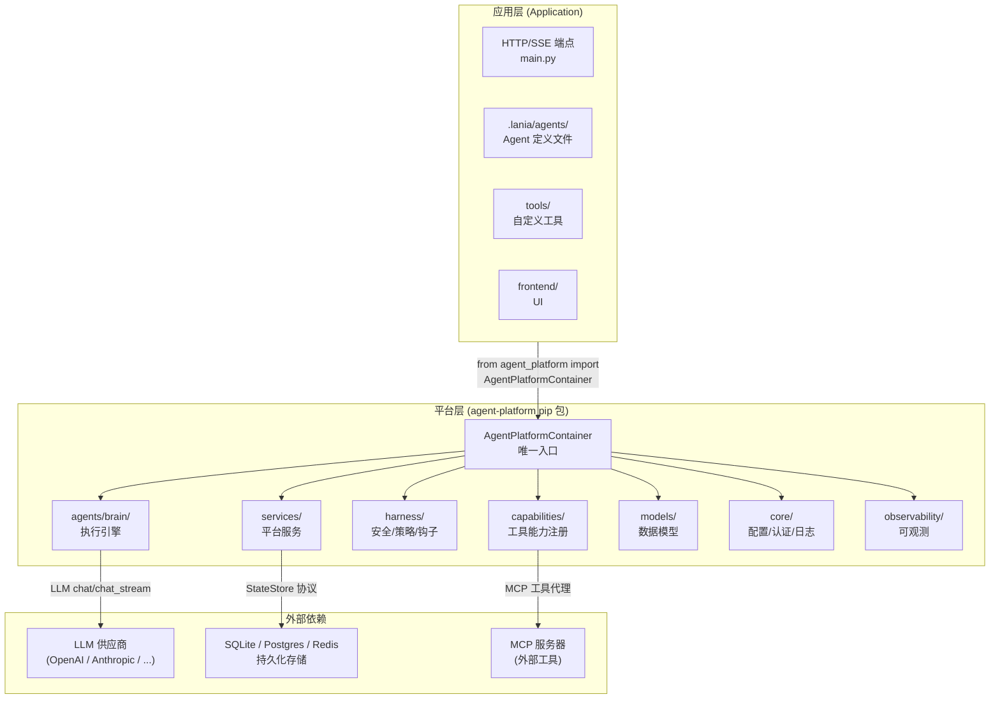

---

### 13.2 扩展点层（Plugin Protocols）

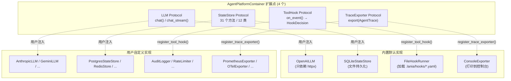

---

### 13.3 原语系统（CustomizationEngine）

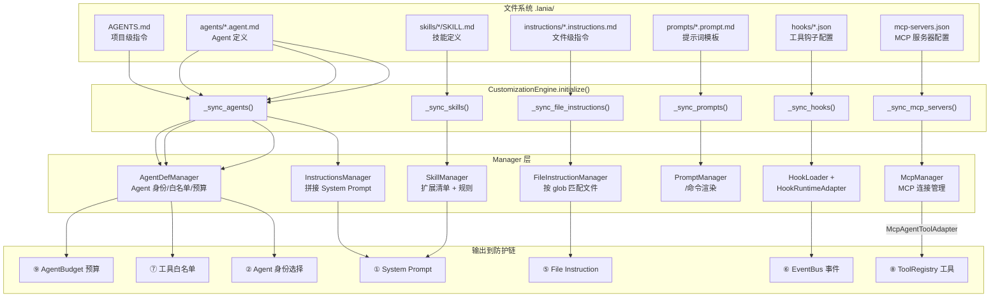

---

### 13.4 存储层

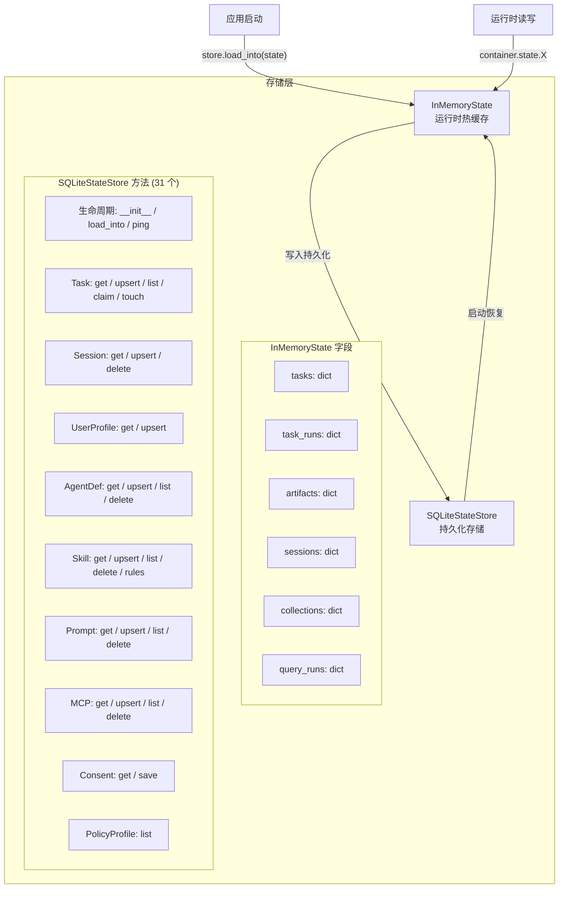

---

### 13.5 Agent 定义架构（双源统一）

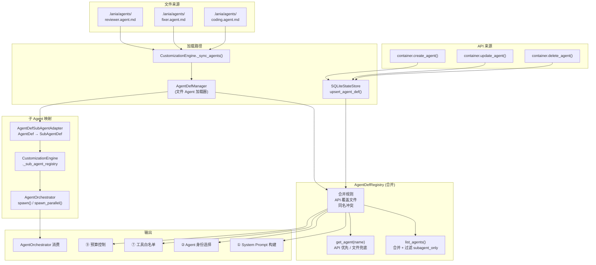

---

### 13.6 Brain 执行链路

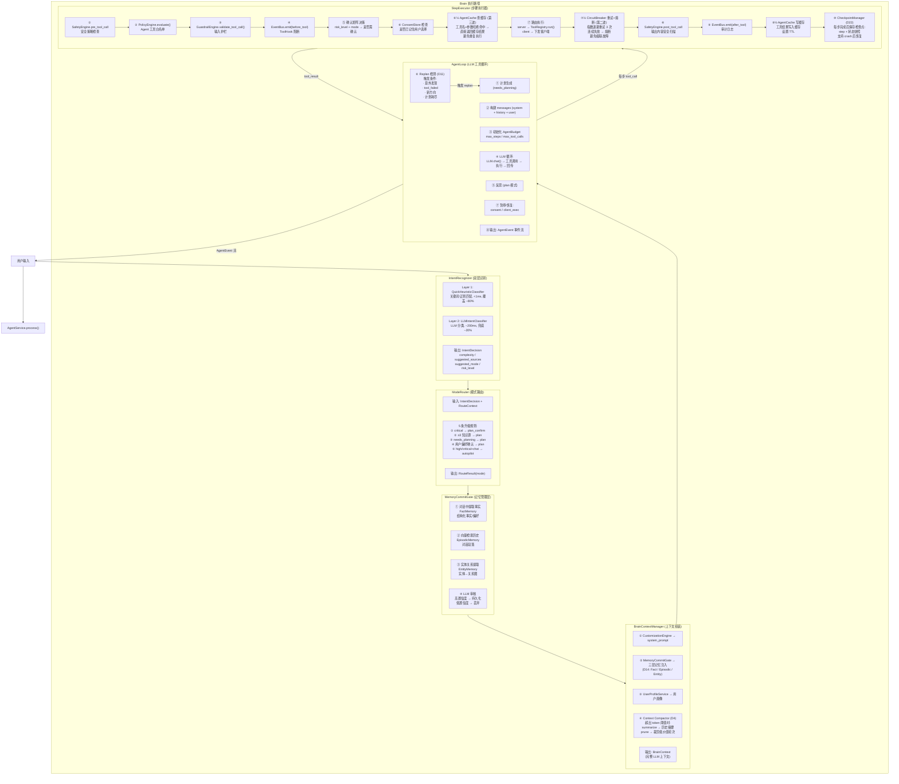

---

### 13.7 工具系统

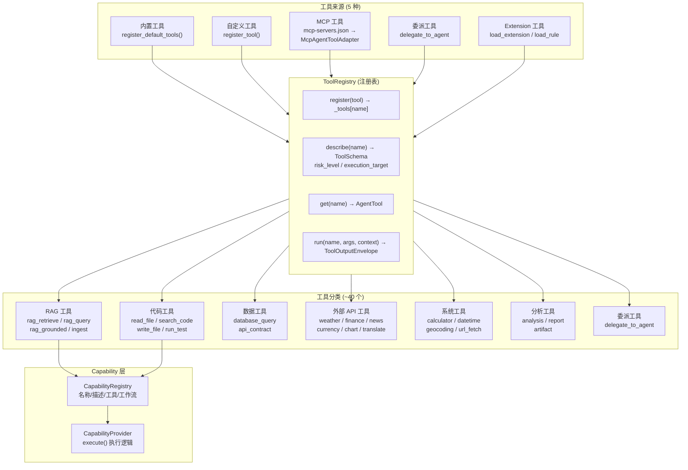

---

### 13.8 防护链（9 层 Defense Chain）

```mermaid
graph LR
    subgraph DC["每次 Agent 请求的 9 层防护链"]
        direction LR

        L1["① System Prompt<br/>InstructionsManager<br/>拼接 AGENTS.md<br/>+ AgentDef + Skill<br/>LLM 可见"]
        L2["② Agent 身份选择<br/>AgentDefManager<br/>决定 system_prompt<br/>+ allowed_tools<br/>LLM 不可见"]
        L3["③ ModeRouter<br/>决定执行模式<br/>chat/plan/autopilot<br/>不受原语影响"]
        L4["④ AgentLoop<br/>接收 system_prompt<br/>+ allowed_tools<br/>LLM 循环"]
        L5["⑤ File Instructions<br/>FileInstructionManager<br/>按 glob 匹配文件<br/>注入 ToolContext"]
        L6["⑥ EventBus (Hooks)<br/>before_tool 可阻断<br/>after_tool 只读审计<br/>tool_failed 告警"]
        L7["⑦ PolicyEngine<br/>Agent 工具白名单<br/>+ 策略 Profile<br/>拒绝未授权工具"]
        L8["⑧ ToolRegistry<br/>MCP 工具 + 全局工具<br/>按 risk_level 分发:<br/>low→inline<br/>medium→thread<br/>high→sandbox"]
        L9["⑨ AgentBudget<br/>max_turns /<br/>max_tool_calls /<br/>max_cost"]
    end

    L1 -->|"字符串拼接"| L2
    L2 -->|"LLM 不可见"| L3
    L3 -->|"模式选择"| L4
    L4 -->|"每步 tool_call"| L5
    L5 -->|"注入指令"| L6
    L6 -->|"可阻断"| L7
    L7 -->|"白名单过滤"| L8
    L8 -->|"执行"| L9
    L9 -->|"超限中止"| L4
```

---

### 13.9 总串联架构图

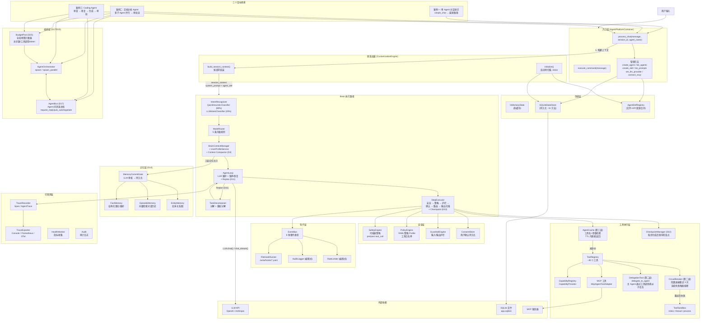

---

### 13.10 接线进度一览（已全部入图，部分待实现代码）

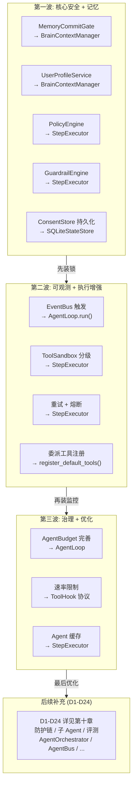

---

### 13.11 功能点与章节映射表

| 功能点 | 章节 | 代码位置 | 状态 |
|---|---|---|---|
| **LLM Protocol** | §2.1 | `agents/brain/` | 已实现 |
| **StateStore Protocol** | §2.2 | `services/_store.py` | 已实现 |
| **ToolHook Protocol** | §2.3 | `harness/hooks.py` | 已实现 |
| **TraceExporter Protocol** | §2.4 | `observability/` | 已实现 |
| **Agent 类型系统** | §2.6 | `services/agent_def_manager.py` | 已实现 |
| **AgentPlatformContainer** | §三 | `container.py` | 已设计 |
| **InMemoryState** | §四 | `services/_state.py` | 已实现 |
| **SQLiteStateStore** | §四 | `services/_store.py` | 已实现 |
| **IntentRecognizer** | §十一 链路 | `agents/brain/intent_recognizer.py` | 已实现 |
| **ModeRouter** | §十一 链路 | `agents/brain/mode_router.py` | 已实现 |
| **AgentLoop** | §十一 链路 | `agents/brain/agent_loop.py` | 已实现 |
| **StepExecutor** | §十一 链路 | `agents/brain/step_executor.py` | 已实现 |
| **SafetyEngine** | §九 第一波 | `harness/safety/engine.py` | 已实现 |
| **PolicyEngine** | §九 第一波 | `harness/policy.py` | 已实现 |
| **GuardrailEngine** | §九 第一波 | `harness/guardrails.py` | 已实现 |
| **ConsentStore** | §九 第一波 | `agents/brain/consent_store.py` | 已实现 |
| **EventBus** | §九 第二波 | `harness/hooks.py` | 已实现 |
| **ToolSandbox** | §九 第二波 | `harness/sandbox.py` | 已实现 |
| **CircuitBreaker (重试+熔断)** | §九 第二波 | `agents/brain/circuit_breaker.py` | 已实现 + 已入图 |
| **DelegationTool** | §九 第二波 | `agents/tools/delegation_tools.py` | 已实现 + 已入图 |
| **AgentBudget** | §九 第三波 | `agents/brain/agent_loop.py` | 已实现 |
| **RateLimiter** | §九 第三波 | `services/rate_limiter.py` | 已实现 |
| **AgentCache** | §九 第三波 | `services/agent_cache.py` | 已实现 + 已入图 |
| **MemoryCommitGate** | §九 第一波 | `services/memory_commit_gate.py` | 已实现 |
| **UserProfileService** | §九 第一波 | `services/user_profile_service.py` | 已实现 |
| **BrainContextManager** | §三 | `agents/brain/context_manager.py` | 已实现 |
| **CustomizationEngine** | §十二 | `services/customization_engine.py` | 已实现 |
| **AgentDefManager** | §十二 | `services/agent_def_manager.py` | 已实现 |
| **SkillManager** | §十二 | `services/skill_manager.py` | 已实现 |
| **PromptManager** | §十二 | `services/prompt_manager.py` | 已实现 |
| **McpManager** | §十二 | `services/mcp_manager.py` | 已实现 |
| **FileInstructionManager** | §十二 | `services/file_instruction_manager.py` | 已实现 |
| **InstructionsManager** | §十二 | `services/instructions_manager.py` | 已实现 |
| **ToolRegistry** | §十三 工具 | `agents/tools/registry.py` | 已实现 |
| **~40 个 AgentTool** | §十三 工具 | `agents/tools/*.py` | 已实现 |
| **CapabilityRegistry** | §十三 工具 | `capabilities/registry.py` | 已实现 |
| **AgentDefRegistry (双源合并)** | §12.7 | 待实现 (D9) | 已设计 |
| **AgentDefSubAgentAdapter** | §12.6 | 待实现 | 已设计 |
| **AgentOrchestrator** | §12.6 | 待实现 (D12) | 已设计 |
| **SubAgentDef 与 spawn** | §12.6 | 待实现 (D12) | 已设计 |
| **TaskDecomposer (Replan)** | §十 D11 | 待实现 | 已设计 + 已入图 |
| **ApprovalWorkflow** | §十 D18 | 待实现 | 已规划 |
| **AgentBus** | §十 D17 | 待实现 | 已设计 + 已入图 |
| **BudgetPool** | §十 D23 | 待实现 | 已设计 + 已入图 |
| **CheckpointManager** | §十 D22 | 待实现 | 已设计 + 已入图 |
| **三层记忆架构** | §十 D14 | 待实现 | 已设计 + 已入图 |
| **Context Compactor** | §十 D4 | 待实现 | 已设计 + 已入图 |
| **EvalSuite** | §十 D19 | 待实现 | 已规划 |

---

### 13.12 多 Agent 协作链路

> 对应 §十一 案例二（文档分析）和案例三（Coding Agent）。覆盖子 Agent 注册、编排、执行、审批、结果合并全流程。

#### 13.12.1 子 Agent 注册链路

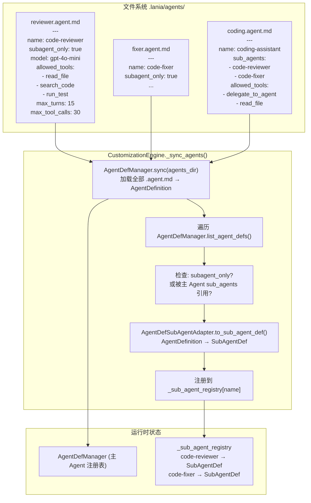

#### 13.12.2 案例二：文档分析 Agent（并行协作）

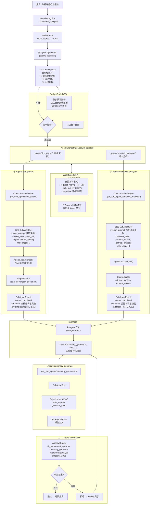

#### 13.12.3 案例三：Coding Agent（串行协作 + 审批门控）

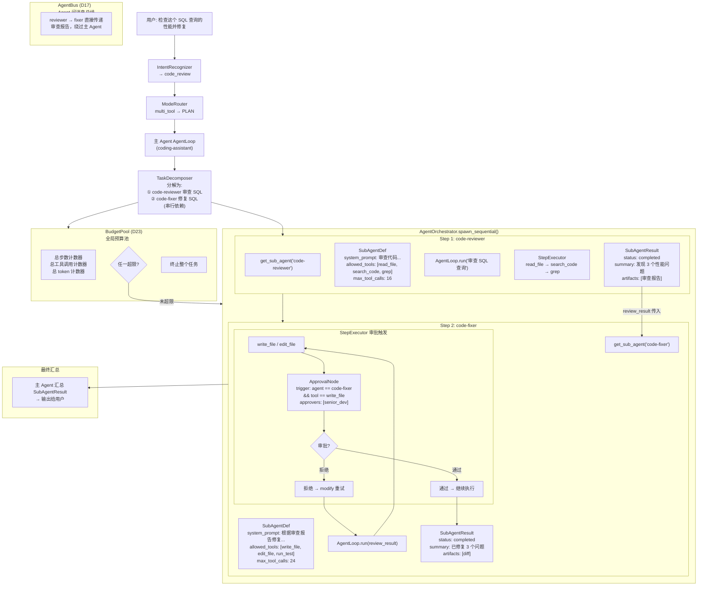

#### 13.12.4 多 Agent 全链路执行序列

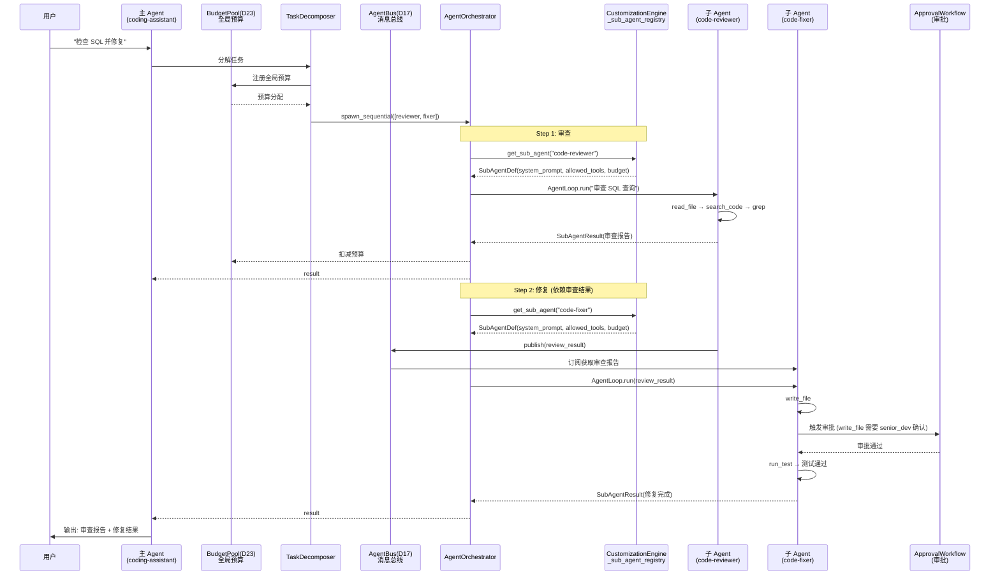

#### 13.12.5 单 Agent 与多 Agent 路径对比

| 维度 | 单 Agent (§11.1) | 多 Agent 并行 (§11.2) | 多 Agent 串行 (§11.3) |
|---|---|---|---|
| **IntentRecognizer 输出** | chat / simple | document_analysis | code_review / code_fix |
| **ModeRouter 结果** | CHAT | PLAN | PLAN |
| **AgentLoop 数量** | 1 个（主） | 1 个主 + N 个子并行 | 1 个主 + N 个子串行 |
| **编排器** | 无 | AgentOrchestrator.spawn_parallel() | AgentOrchestrator.spawn_sequential() |
| **审批门控** | 无 | ApprovalWorkflow（报告审批） | ApprovalWorkflow（写文件审批） |
| **子 Agent 来源** | 无 | SubAgentDef（代码注册） | SubAgentDef（.agent.md 适配） |
| **BudgetPool** | 单 Agent 级 AgentBudget | 全局计数器，任一超限终止整个任务 (D23) | 同左 |
| **AgentBus** | 无 | 子 Agent 通过总线直接通信 (D17) | review_result 通过总线发布/订阅 |
| **结果合并** | 无 | 主 Agent 汇总 + 生成报告 | 上一步结果传入下一步 |
