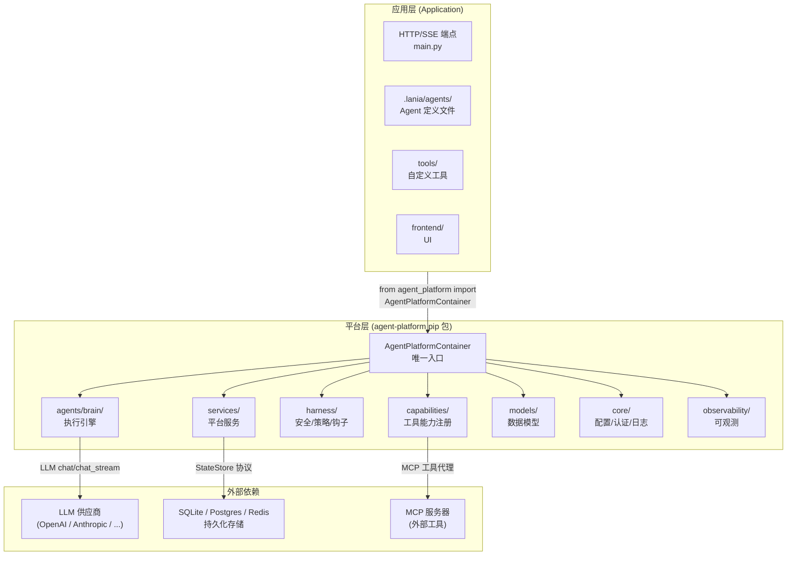

# 2.1 整体分层

> 对应 `agent-platform-package-design.md` 第二章架构图的 2.1 节。

## 说明

- **应用层**：使用平台包的上层应用，通过 `from agent_platform import AgentPlatformContainer` 集成
- **平台层**：`agent-platform` pip 包，`AgentPlatformContainer` 为唯一入口
- **外部依赖**：LLM 供应商、持久化存储、MCP 服务器
