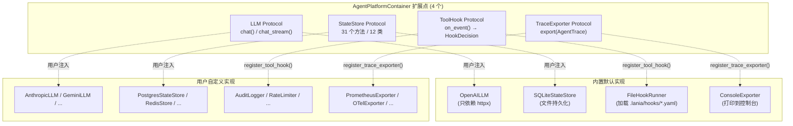

# 2.2 扩展点层（Plugin Protocols）

> 对应 `agent-platform-package-design.md` 第二章架构图的 2.2 节。

## 扩展点汇总

| 扩展点 | 协议 | 内置实现 | 谁需要实现 |
|---|---|---|---|
| **LLM** | `LLM` | `OpenAILLM` | 想换模型供应商的人 |
| **Storage** | `StateStore` | `SQLiteStateStore` | 生产环境需要高可用存储的人 |
| **Tool Hook** | `ToolHook` | `FileHookRunner`（加载 `.lania/hooks/`） | 需要审计/日志/自定义阻断逻辑的人 |
| **Observability** | `TraceExporter` | `ConsoleExporter` | 需要监控/告警/性能分析的人 |
