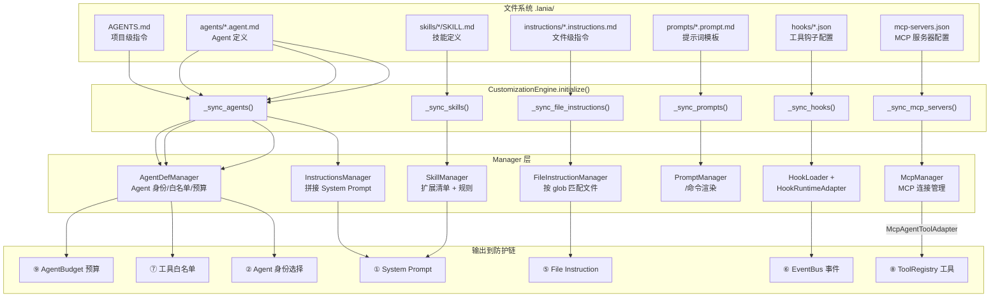

# 2.3 原语系统（CustomizationEngine）

> 对应 `agent-platform-package-design.md` 第二章架构图的 2.3 节。

```mermaid
graph TB
    subgraph Files["文件系统 .lania/"]
        AG["AGENTS.md<br/>项目级指令"]
        AD["agents/*.agent.md<br/>Agent 定义"]
        SK["skills/*/SKILL.md<br/>技能定义"]
        FI["instructions/*.instructions.md<br/>文件级指令"]
        PR["prompts/*.prompt.md<br/>提示词模板"]
        HK["hooks/*.json<br/>工具钩子配置"]
        MC["mcp-servers.json<br/>MCP 服务器配置"]
    end

    subgraph CE["CustomizationEngine.initialize()"]
        S1["_sync_agents()"]
        S2["_sync_skills()"]
        S3["_sync_prompts()"]
        S4["_sync_mcp_servers()"]
        S5["_sync_hooks()"]
        S6["_sync_file_instructions()"]
    end

    subgraph Managers["Manager 层"]
        IM["InstructionsManager<br/>拼接 System Prompt"]
        ADM["AgentDefManager<br/>Agent 身份/白名单/预算"]
        SM["SkillManager<br/>扩展清单 + 规则"]
        FIM["FileInstructionManager<br/>按 glob 匹配文件"]
        PM["PromptManager<br/>/命令渲染"]
        HL["HookLoader +<br/>HookRuntimeAdapter"]
        MM["McpManager<br/>MCP 连接管理"]
    end

    subgraph Output["输出到防护链"]
        O1["① System Prompt"]
        O2["② Agent 身份选择"]
        O3["⑦ 工具白名单"]
        O4["⑧ ToolRegistry 工具"]
        O5["⑥ EventBus 事件"]
        O6["⑤ File Instruction"]
        O7["⑨ AgentBudget 预算"]
    end

    AG --> S1 --> IM --> O1
    AD --> S1 --> ADM --> O2
    AD --> S1 --> ADM --> O3
    AD --> S1 --> ADM --> O7
    SK --> S2 --> SM --> O1
    FI --> S6 --> FIM --> O6
    PR --> S3 --> PM
    MC --> S4 --> MM -->|"McpAgentToolAdapter"| O4
    HK --> S5 --> HL --> O5
```

## 说明

CustomizationEngine 在启动时扫描 `.lania/` 目录下的 7 类原语文件，通过 Manager 层处理后注入到防护链的对应层级。每个原语类型有不同的注入点和注入机制。
