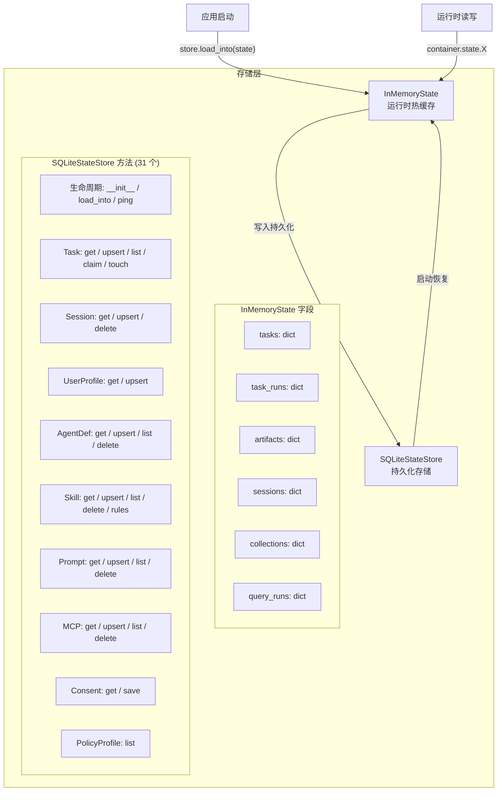

# 2.4 存储层

> 对应 `agent-platform-package-design.md` 第二章架构图的 2.4 节。

## 分层设计

| 层级 | 说明 |
|---|---|
| **InMemoryState** | 运行时热缓存，纯数据容器，模块通过 `container.state.X` 读写 |
| **SQLiteStateStore** | 持久化存储，31 个方法分 10 类（Task/TaskRun/Artifact/Session/UserProfile/AgentDef/Skill/Prompt/MCP/Consent/PolicyProfile） |

启动时 `store.load_into(state)` 从 SQLite 恢复数据到热缓存。
