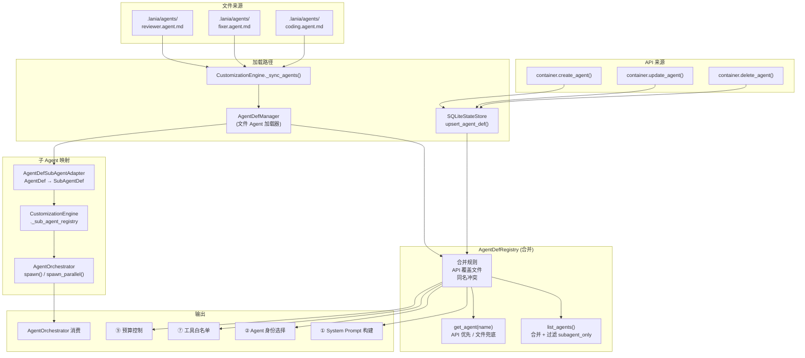

# 2.5 Agent 定义架构（双源统一）

> 对应 `agent-platform-package-design.md` 第二章架构图的 2.5 节。

## 双源合并策略

- 文件来源（`.agent.md`）和 API 来源（`create_agent()`）共享同一个 `AgentDefinition` 数据模型
- `AgentDefRegistry` 聚合器合并双源，API 覆盖同名文件 Agent
- `AgentDefSubAgentAdapter` 将 AgentDef 适配为 SubAgentDef，供 `AgentOrchestrator` 使用
