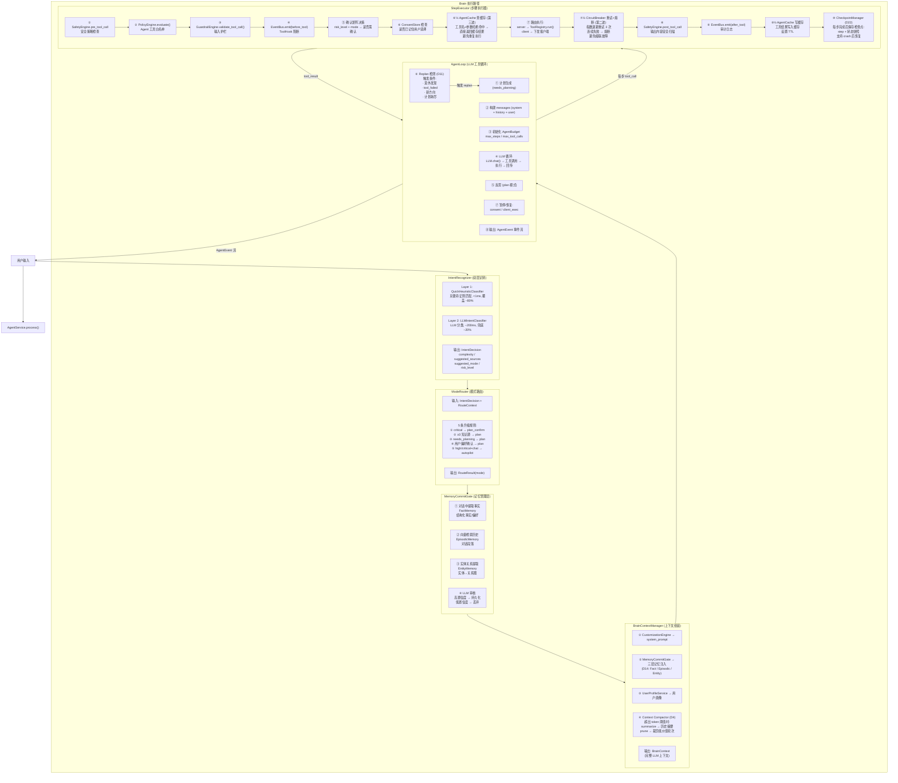

# 2.6 Brain 执行链路

> 对应 `agent-platform-package-design.md` 第二章架构图的 2.6 节。

## 执行路径说明

| 阶段 | 组件 | 职责 |
|---|---|---|
| 意图识别 | IntentRecognizer | 双层分类器：快速启发式（80%）+ LLM 兜底（20%） |
| 模式路由 | ModeRouter | 5 条升级规则决定 chat/plan/autopilot/plan_confirm 模式 |
| 记忆管理 | MemoryCommitGate | 三层记忆：Fact / Episodic / Entity，LLM 审核后持久化 |
| 上下文组装 | BrainContextManager | 拼接 system_prompt + 记忆注入 + 用户画像 + 上下文压缩 |
| LLM 循环 | AgentLoop | 计划生成 → LLM 调用 → 工具执行 → 反射 → Replan 检测 |
| 步骤执行 | StepExecutor | 安全策略 → 白名单 → 护栏 → 确认 → 缓存 → 路由 → 熔断 → 输出扫描 → 检查点 |
