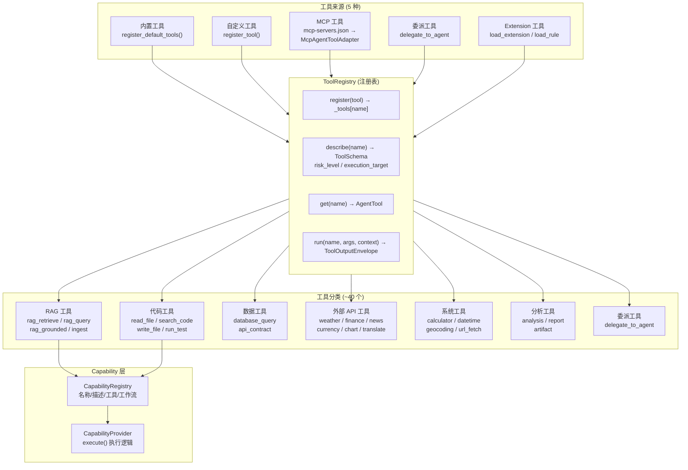

# 2.7 工具系统

> 对应 `agent-platform-package-design.md` 第二章架构图的 2.7 节。

## 工具来源说明

| 来源 | 注册方式 | 示例 |
|---|---|---|
| 内置工具 | `register_default_tools()` | 天气、金融、日历等 20+ 工具 |
| 自定义工具 | `register_tool()` | 应用层自定义工具 |
| MCP 工具 | mcp-servers.json → `McpAgentToolAdapter` | 外部 MCP 服务器工具 |
| 委派工具 | `delegate_to_agent` | 主 Agent 通过工具调用委派子任务 |
| Extension 工具 | `load_extension / load_rule` | Skill 扩展工具 |
