# 2.8 防护链（9 层 Defense Chain）

> 对应 `agent-platform-package-design.md` 第二章架构图的 2.8 节。

```mermaid
graph LR
    subgraph DC["每次 Agent 请求的 9 层防护链"]
        direction LR

        L1["① System Prompt<br/>InstructionsManager<br/>拼接 AGENTS.md<br/>+ AgentDef + Skill<br/>LLM 可见"]
        L2["② Agent 身份选择<br/>AgentDefManager<br/>决定 system_prompt<br/>+ allowed_tools<br/>LLM 不可见"]
        L3["③ ModeRouter<br/>决定执行模式<br/>chat/plan/autopilot<br/>不受原语影响"]
        L4["④ AgentLoop<br/>接收 system_prompt<br/>+ allowed_tools<br/>LLM 循环"]
        L5["⑤ File Instructions<br/>FileInstructionManager<br/>按 glob 匹配文件<br/>注入 ToolContext"]
        L6["⑥ EventBus (Hooks)<br/>before_tool 可阻断<br/>after_tool 只读审计<br/>tool_failed 告警"]
        L7["⑦ PolicyEngine<br/>Agent 工具白名单<br/>+ 策略 Profile<br/>拒绝未授权工具"]
        L8["⑧ ToolRegistry<br/>MCP 工具 + 全局工具<br/>按 risk_level 分发:<br/>low→inline<br/>medium→thread<br/>high→sandbox"]
        L9["⑨ AgentBudget<br/>max_turns /<br/>max_tool_calls /<br/>max_cost"]
    end

    L1 -->|"字符串拼接"| L2
    L2 -->|"LLM 不可见"| L3
    L3 -->|"模式选择"| L4
    L4 -->|"每步 tool_call"| L5
    L5 -->|"注入指令"| L6
    L6 -->|"可阻断"| L7
    L7 -->|"白名单过滤"| L8
    L8 -->|"执行"| L9
    L9 -->|"超限中止"| L4
```

## 9 层防护说明

| 层级 | 组件 | LLM 可见 | 职责 |
|---|---|---|---|
| ① | InstructionsManager | ✅ | 拼接 System Prompt（AGENTS.md + AgentDef + Skill） |
| ② | AgentDefManager | ❌ | 决定身份、工具白名单 |
| ③ | ModeRouter | ❌ | 决定执行模式（chat/plan/autopilot） |
| ④ | AgentLoop | ✅ | LLM 循环执行 |
| ⑤ | FileInstructionManager | ✅ | 按 glob 匹配文件注入指令 |
| ⑥ | EventBus (Hooks) | ❌ | before_tool 可阻断，after_tool 审计 |
| ⑦ | PolicyEngine | ❌ | 工具白名单 + 策略 Profile |
| ⑧ | ToolRegistry | ✅ | 按 risk_level 分发执行（inline/thread/sandbox） |
| ⑨ | AgentBudget | ❌ | 超限中止（max_turns/max_tool_calls/max_cost） |
