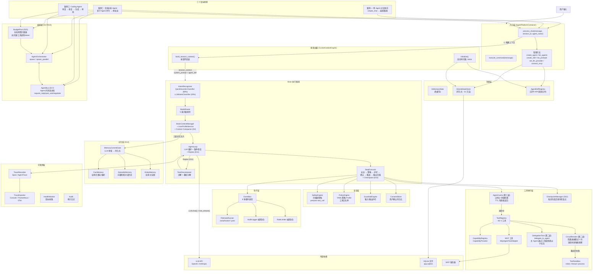

# 2.9 总串联架构图

> 对应 `agent-platform-package-design.md` 第二章架构图的 2.9 节。此图为所有子模块的串联总图。

## 分层总览

| 层 | 职责 |
|---|---|
| **入口层** | `AgentPlatformContainer` 统一入口，管理方法和对话方法 |
| **原语加载** | CustomizationEngine 启动时扫描 `.lania/`，按请求组装上下文 |
| **存储层** | InMemoryState（热缓存）+ SQLiteStateStore（持久化） |
| **Brain 执行路径** | IntentRecognizer → ModeRouter → BrainContextManager → AgentLoop → StepExecutor |
| **记忆层** (D14) | FactMemory / EpisodicMemory / EntityMemory |
| **安全层** | SafetyEngine / PolicyEngine / GuardrailEngine / ConsentStore |
| **钩子层** | EventBus + FileHookRunner + 编程式 Hook |
| **工具执行层** | ToolRegistry + MCP + 缓存 + 熔断 + 沙箱 + 检查点 |
| **编排层** (D17/D23) | BudgetPool / AgentBus / AgentOrchestrator |
| **可观测层** | TraceRecorder / TraceExporter / HealthMonitor / Audit |
