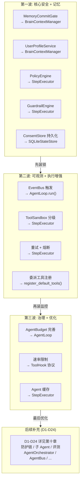

# 2.10 接线进度一览

> 对应 `agent-platform-package-design.md` 第二章架构图的 2.10 节。

## 三波接线说明

| 波次 | 优先级 | 功能 | 接入收益 |
|---|---|---|---|
| **第一波** | 最高 | MemoryCommitGate / UserProfileService / PolicyEngine / GuardrailEngine / ConsentStore | 先装锁：防止记忆污染、越权操作、恶意输出 |
| **第二波** | 高 | EventBus / ToolSandbox / CircuitBreaker / DelegationTool | 再装监控：可观测、执行隔离、容错 |
| **第三波** | 中 | AgentBudget / RateLimiter / AgentCache | 最后优化：预算控制、限流、缓存加速 |
