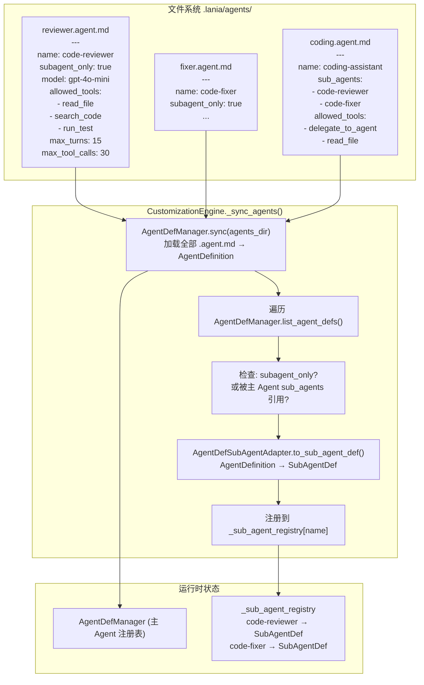

# 2.12.1 子 Agent 注册链路

> 对应 `agent-platform-package-design.md` 第二章 2.12.1 节。

## 说明

子 Agent 通过 `.agent.md` 文件中的 `subagent_only: true` 标记进行注册，`AgentDefSubAgentAdapter` 负责将 `AgentDefinition` 适配为 `SubAgentDef`，注册到 `_sub_agent_registry` 中供 `AgentOrchestrator` 使用。
