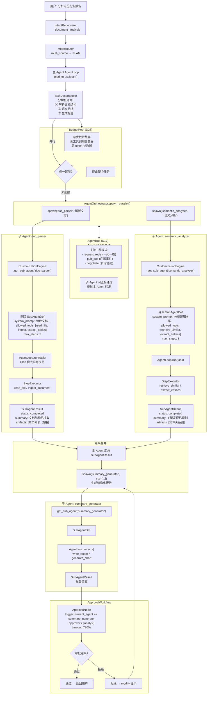

# 2.12.2 案例二：文档分析 Agent（并行协作）

> 对应 `agent-platform-package-design.md` 第二章 2.12.2 节。

## 执行流程

1. IntentRecognizer 识别为 `document_analysis`
2. ModeRouter 因 multi_source 升级为 PLAN 模式
3. TaskDecomposer 分解为解析、分析、汇总三个子任务
4. AgentOrchestrator.spawn_parallel() 并行执行 doc_parser 和 semantic_analyzer
5. 主 Agent 汇总结果后 spawn summary_generator 生成报告
6. ApprovalWorkflow 触发审批，分析师确认后返回结果
