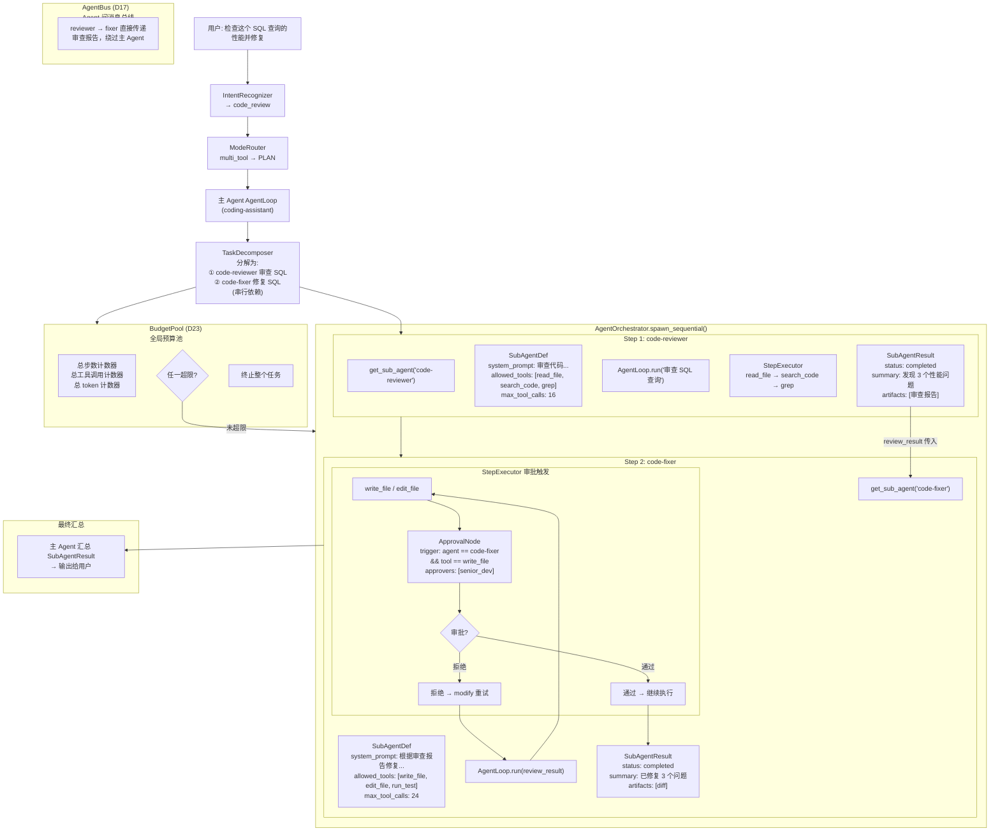

# 2.12.3 案例三：Coding Agent（串行协作 + 审批门控）

> 对应 `agent-platform-package-design.md` 第二章 2.12.3 节。

## 执行流程

1. IntentRecognizer 识别为 `code_review`
2. ModeRouter 因 multi_tool 升级为 PLAN 模式
3. TaskDecomposer 分解为审查和修复两个串行子任务
4. Step 1: code-reviewer 审查 SQL 代码，输出审查报告
5. Step 2: code-fixer 根据审查报告修复，write_file 触发审批门控
6. senior_dev 审批通过后继续执行，最终汇总输出
