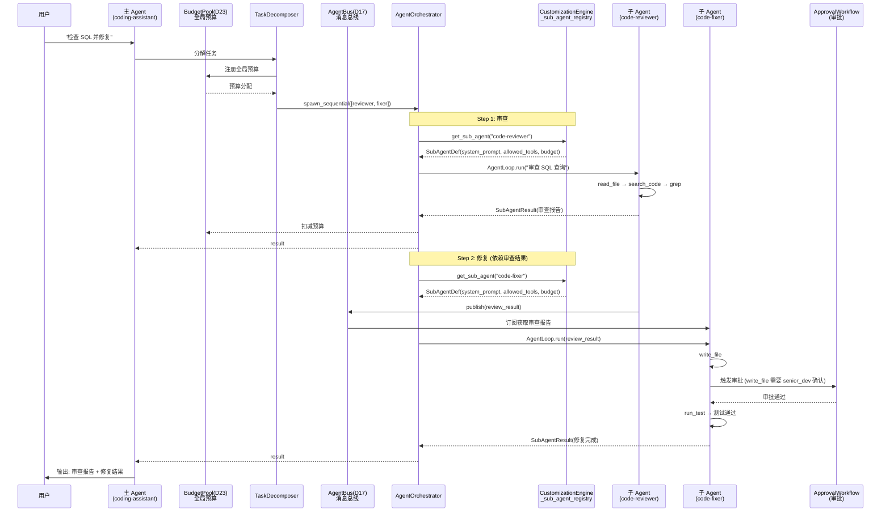

# 2.12.4 多 Agent 全链路执行序列

> 对应 `agent-platform-package-design.md` 第二章 2.12.4 节。

## 执行序列说明

| 步骤 | 角色 | 动作 |
|---|---|---|
| 1 | Main | 接收用户请求 |
| 2 | TD | 分解为串行子任务 |
| 3 | BP | 注册全局预算 |
| 4 | AO | 启动串行编排 |
| 5 | Sub1 | 审查 SQL 代码 |
| 6 | AB | reviewer 发布审查结果，fixer 订阅 |
| 7 | Sub2 | 根据审查结果修复代码 |
| 8 | AP | write_file 触发审批 |
| 9 | Sub2 | 审批通过后运行测试 |
| 10 | Main | 汇总结果输出给用户 |
